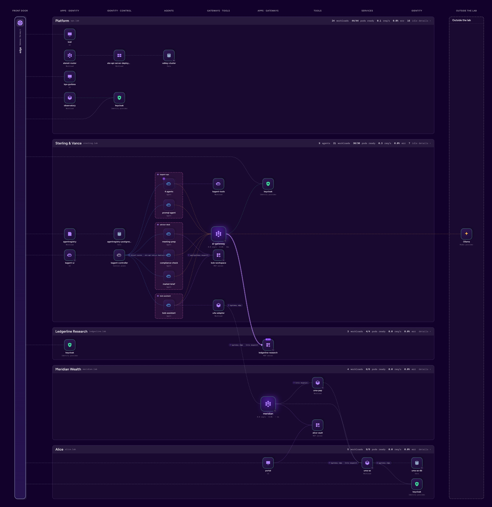
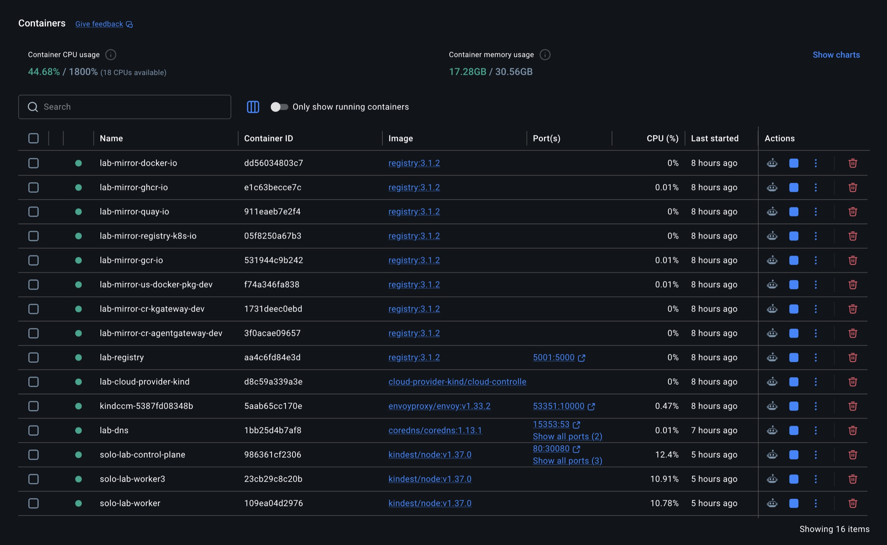
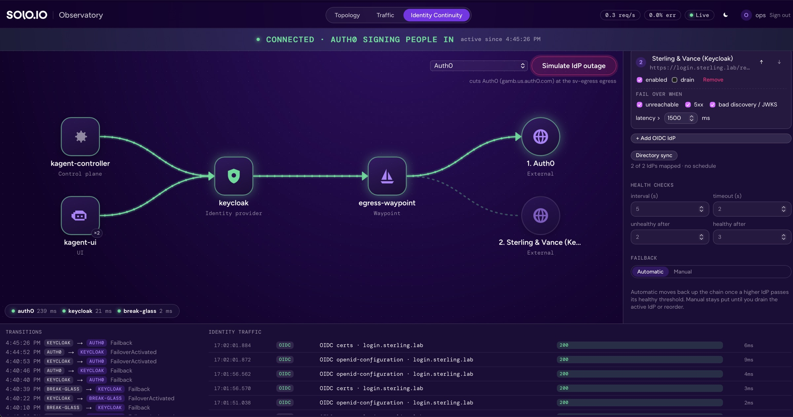
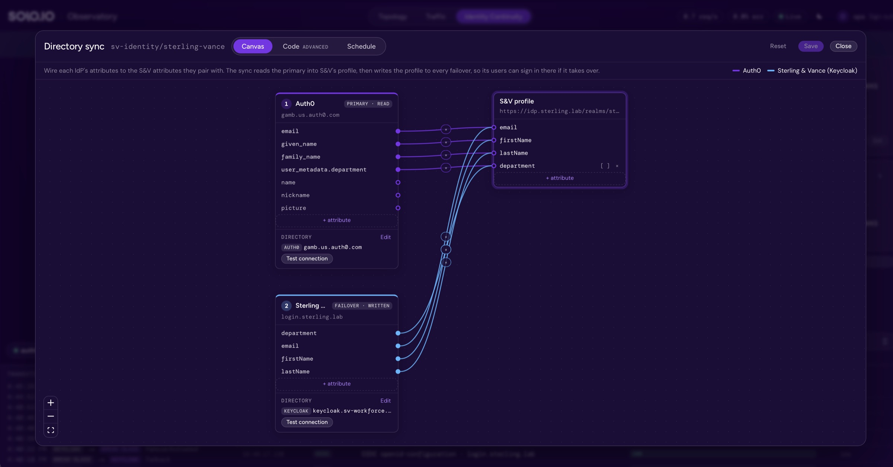
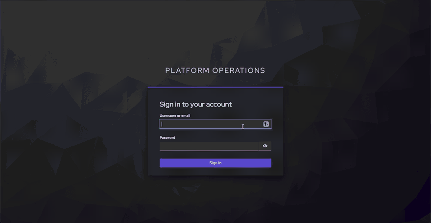

# solo-lab

[](docs/ARCHITECTURE.md#install-order)
[](docs/ARCHITECTURE.md#enforcement-layers)
[](docs/ARCHITECTURE.md#enforcement-layers)
[](docs/ARCHITECTURE.md#workloads-and-identities)
[](docs/IDENTITY-FLOWS.md)
[](docs/ENTERPRISE.md)
[](https://u4a.ai)
[](https://www.solo.io)
[](https://docs.solo.io)

A local, production-shaped lab for the [Solo.io](https://www.solo.io) AI platform on kind: Istio
ambient, kgateway, agentgateway, kagent + kmcp, Agent Substrate,
agentregistry and Keycloak, plus two lab apps: the **Observatory** (a live
control-plane UI) and an **identity continuity** controller (IdP failover).



The lab models four parties on a shared platform (an advisory firm, its SaaS
vendor, a client and her brokerage), each with its own namespaces, SPIFFE
identities, IdP and hostnames. They meet only at the edge. See
[docs/ARCHITECTURE.md](docs/ARCHITECTURE.md).

## Products

| Product | In this lab | Product page | Docs |
| --- | --- | --- | --- |
| kgateway | the edge: TLS, one listener per party, SSO for every UI | [solo.io](https://www.solo.io/products/kgateway) | [docs.solo.io/kgateway](https://docs.solo.io/kgateway/) |
| agentgateway | the firm's AI gateway (models, Cross App Access), its MCP waypoint, Meridian's gateway | [solo.io](https://www.solo.io/products/agentgateway) | [docs.solo.io/agentgateway](https://docs.solo.io/agentgateway/) |
| kagent + kmcp | agents, their controller and UI; MCP servers as Kubernetes resources | [solo.io](https://www.solo.io/products/kagent) | [docs.solo.io/kagent](https://docs.solo.io/kagent/) |
| Agent Substrate | every agent runs in a snapshot-backed sandbox on a worker pool | [solo.io](https://www.solo.io/products/kagent) | [docs.solo.io/kagent](https://docs.solo.io/kagent/) |
| agentregistry | the firm's catalog of agents, MCP servers and skills | [solo.io](https://www.solo.io/products/agentregistry) | [docs.solo.io/agentregistry](https://docs.solo.io/agentregistry/) |
| Istio ambient | mTLS and a SPIFFE identity for every workload, waypoints, default-deny per party | [solo.io](https://www.solo.io/products/istio) | [docs.solo.io/istio](https://docs.solo.io/istio/) |

Enterprise editions, trial licences and support: [solo.io/get-started](https://www.solo.io/get-started).

## Requirements

- macOS, Linux or Windows with WSL2 (developed on macOS on Apple silicon; x86_64 and arm64 images throughout)
- Docker Desktop, OrbStack or Colima on macOS, or Docker Engine with buildx on Linux, with 24 GB or more for Docker (`make preflight` refuses under 16 GB; the full lab uses about 17 GB)
- kind v0.32 or newer, kubectl, helm, jq, [yq v4](https://github.com/mikefarah/yq), envsubst (gettext), openssl, python3, git, curl
  - macOS: `brew install kind kubectl helm jq yq gettext openssl`
  - Debian/Ubuntu: `sudo apt-get install jq gettext-base openssl python3 git curl docker-buildx-plugin libnss3-tools`, then kind, kubectl, helm and yq from their release pages
  - Fedora: `sudo dnf install jq gettext openssl python3 git curl nss-tools`, same for the rest
- Ports 80 and 443 free on 127.0.0.1, or set `LAB_HTTP_PORT`/`LAB_HTTPS_PORT` in `.env`
- A model: [Ollama](https://ollama.com) on the host (`ollama pull qwen3.8:27b`), or an Anthropic or OpenAI key

`make preflight` checks all of this, and `make up` runs it first. On a
Docker VM (Docker Desktop, OrbStack, Colima) it also raises the inotify
limits inside the VM, which reset whenever the VM restarts. With Docker
Engine they are the host's own, and preflight says what to run if they're
too low.

`make machine-setup` makes `*.lab` resolve to 127.0.0.1 and trusts the lab CA:
`/etc/resolver` and the System keychain on macOS; systemd-resolved (or a
marked block in `/etc/hosts`) and the distro's trust store on Linux, plus the
NSS databases Chrome and Firefox read. On WSL2 it sets up the distro and
prints the two commands for a browser on Windows.

## Quick start

```bash
cp .env.example .env          # optional: model provider, keys, Auth0, enterprise
make machine-setup            # once per machine, sudo: *.lab DNS and the lab CA
make up                       # cluster, platform and every demo (~30 min cold)
make verify                   # rewinds the demos, then every enforcement check
make status                   # pods, active IdP, URLs and sign-ins
```

Story 2 builds Alice's and Meridian's services from
[uma4agents](https://github.com/nickgamb/uma4agents): a checkout beside this
repo (`../uma4agents`) or `U4A_SRC` if you have one, otherwise the install
clones the pinned commit into `.lab/uma4agents`.

`make up` is idempotent. Image caches and the lab CA outlive the cluster, so
a rebuild after `make down` is much faster than the first.

**Updating an existing lab.** After pulling, `make platform` re-applies every
layer and demo. A lab from before S&V's own Keycloak needs at least
`make layer-45 layer-47 layer-95`: the `workforce` realm, and the chain
ending in `break-glass`.

What it leaves running in Docker: pull-through mirrors for each upstream
registry (`lab-mirror-*`), a push registry for lab-built images
(`lab-registry`, `localhost:5001` unless `LAB_REGISTRY_PORT` says otherwise), `lab-dns` (answers `*.lab` on port
15353), `cloud-provider-kind`, and the kind nodes (one control plane, three
workers in zones a, b and c). The full lab uses about 17 GB of memory.



## What you can open

| URL | What | Sign in |
| --- | --- | --- |
| https://observatory.ops.lab | Observatory: topology, traffic, identity continuity | `ops` / `ops-demo` |
| https://kagent.sterling.lab | kagent, where Bob's agents run | Bob at S&V's active IdP: Auth0 (`bob@sterling.lab`, your password) or S&V's own Keycloak (`bob` / `bob-demo`) |
| https://registry.sterling.lab | agentregistry | S&V sign-in, as for kagent |
| https://portal.alice.lab | Alice's portal (her grants and terms) | `alice` / `alice-demo` |
| https://grafana.ops.lab | Grafana | `ops` / `ops-demo` |
| https://kiali.ops.lab | Kiali mesh graph (view-only) | `ops` / `ops-demo` |
| https://idp.sterling.lab/realms/sterling-vance/account | S&V broker account: sign-in through S&V's active IdP | S&V sign-in, as for kagent |
| https://login.sterling.lab/realms/workforce/account | S&V's own Keycloak (an IdP in `ENTERPRISE_IDP`): a user's own account | `bob` / `bob-demo` |
| https://llm.sterling.lab/v1 | the firm's model route for developers: OpenAI chat completions or Anthropic messages | API key `LLM_API_KEY` in `.lab/secrets.env` (docs/COMMANDS.md) |

APIs on the edge, for agents and the checks rather than browsers:
`https://as.alice.lab` (Alice's authorization server), `https://gateway.meridian.lab/mcp`
(Meridian's MCP gateway; UMA-protected), `https://mcp.ledgerline.lab/mcp`
(Ledgerline Research; needs a Ledgerline token), and each party's issuer,
`https://idp.<party>.lab/realms/<realm>` (`sterling-vance`, `alice`,
`ledgerline`, `ops`).

Demo accounts: `bob` (`bob-demo`, S&V group `advisors`); `carol`
(`carol-demo`, S&V's own Keycloak): another S&V employee; `ops` (`ops-demo`,
groups `platform-admins` / `observatory-admins`): realm `ops` for the
Observatory, Grafana and Kiali, and S&V's break-glass platform admin at the
broker, the only sign-in when every IdP is down; `alice` (`alice-demo`, her
own realm). No user is in S&V's `compliance` group, which the `export_book`
tool needs; add one to group `compliance` at the broker (realm
`sterling-vance`) to try it.

Generated secrets (Keycloak admin passwords, client secrets) are in
`.lab/secrets.env`, created on first install and gitignored. The edge publishes
only each party's realm, not Keycloak's admin console; reach that with a
port-forward ([COMMANDS.md](docs/COMMANDS.md#identity)).

## Demos

Each demo has a card: a two-screen script of what to do and what to say.
Open it in a browser (`open docs/cards/<card>.html` on macOS, `xdg-open` on Linux).

| Card | Shows | Checks |
| --- | --- | --- |
| [Bob](docs/cards/bob.html) | Bob's agent acts for Bob: RFC 8693 token exchange at the MCP waypoint, per-tool policy, human approval for writes, Cross App Access (ID-JAG) to a SaaS | `make bob-verify` |
| [Bob to Alice](docs/cards/bob-to-alice.html) | the same agent asks Alice for her data on her terms (UMA for agents) | `make alice-verify` |
| [Observatory tour](docs/cards/observatory.html) | every story end to end from one command, watched live: the agent waking, verified tokens per hop, refusals, Alice's terms, an IdP outage | `make tour` |
| [Identity continuity](docs/cards/identity-continuity.html) | a real network outage of the active IdP, automatic failover to the next one, and failback, live in the Observatory | `make continuity-verify` |
| [Gluu](docs/cards/gluu.html) (experimental) | Bob signs in with a passkey at Gluu, his agent reaches Ledgerline as him: Gluu vouches (ID-JAG), Ledgerline's Gluu redeems it, every hop checked and logged | `make bob-verify` |

`make reset` rewinds every demo without a rebuild. The identity continuity
demo needs an Auth0 tenant (free tier is enough):
[docs/IDENTITY-CONTINUITY.md](docs/IDENTITY-CONTINUITY.md#auth0-setup).

## Observatory

A live view of the running lab (topology, traffic with the tokens each hop
verified, identity continuity), built from the cluster at runtime, so a
different lab renders the same way.

- **Topology:** every workload by zone and call stage, live traffic on the
  wires, a details panel per node with its live YAML (edit and apply), four
  views (All, Identity, Agents & tools, Cross-party), and PNG export.
- **Traffic:** every gateway's access log, with the verified token claims on
  each request.
- **Identity Continuity:** the sign-in chain, the outage button, the rule
  builder, and the directory sync.



S&V's broker (Keycloak at `idp.sterling.lab`) routes sign-in to the firm's
IdPs in failover order: here Auth0, then the Keycloak S&V runs itself at
`login.sterling.lab`. The directory sync keeps those IdPs in step so
whichever one is active signs each employee in with the same profile: it
reads the primary IdP's user attributes into S&V's profile on the broker,
then writes that profile to every failover IdP, creating the users the
primary has. Each IdP's attributes are detected from its directory and wired
to S&V's on a canvas; the same mapping is editable as JSON, and the sync runs
on a schedule or on demand.



[](https://youtu.be/Y3P4a7HRvVs)

The full walkthrough at normal speed, on YouTube: [solo-lab Observatory](https://youtu.be/Y3P4a7HRvVs) (3 min).

See [docs/OBSERVATORY.md](docs/OBSERVATORY.md).

## Configuration

`.env` (copy `.env.example`, gitignored) holds everything personal:

| Key | Used for |
| --- | --- |
| `LLM_PROVIDER` | `ollama` (default), `anthropic` or `openai`; apply with `make llm` |
| `LLM_FALLBACK`, `LLM_FALLBACK_MODEL` | a second provider (and model) the gateway fails over to; apply with `make llm` |
| `OLLAMA_MODEL`, `OLLAMA_URL` | the local model and where the cluster reaches it |
| `ANTHROPIC_API_KEY`, `ANTHROPIC_MODEL`, `OPENAI_API_KEY`, `OPENAI_MODEL` | hosted models (held by agentgateway only) |
| `ENTERPRISE_IDP` | S&V's IdPs in failover order (`okta`, `auth0`, `gluu`, `keycloak`; default `auth0,keycloak`): who signs Bob in and, for an IdP that issues ID-JAGs, who vouches for him to Ledgerline; the broker vouches otherwise |
| `RESOURCE_AS`, `RESOURCE_AS_ISSUER` | Ledgerline's authorization server: `keycloak` (default) or `gluu` |
| `AUTH0_ISSUER`, `AUTH0_CLIENT_ID`, `AUTH0_CLIENT_SECRET` | the auth0 IdP (your Auth0 tenant); left out without an issuer |
| `AUTH0_DIRECTORY_CLIENT_ID`, `AUTH0_DIRECTORY_CLIENT_SECRET` | Auth0's Management API, for the directory sync |
| `config/continuity.local.yaml` | this lab's own S&V profile attributes and IdP mappings, kept across rebuilds (format: `config/continuity.example.yaml`) |
| `OKTA_ISSUER`, `OKTA_CLIENT_ID` | the okta IdP; the broker vouches for its users |
| `GLUU_ISSUER`, `GLUU_CLIENT_ID` | the gluu IdP, authenticated with S&V's keys ([GLUU.md](docs/GLUU.md)) |
| `KEYCLOAK_ISSUER`, `KEYCLOAK_CLIENT_ID` | the keycloak IdP; default S&V's own at `login.sterling.lab` |
| `<NAME>_CLIENT_SECRET` | optional per IdP; without it S&V authenticates with its keys (`make xaa-keys`) |
| `EDITION`, `<PRODUCT>_EDITION`, `SOLO_LICENSE_KEY` | Solo Enterprise, all products or one at a time |
| `SOLO_<PRODUCT>_LICENSE_KEY` | a licence for one product, in place of `SOLO_LICENSE_KEY` |
| `LAB_PASSWORD_GRANT` | (`config/lab.env`) the password grant on Alice's portal client |

`config/lab.env` holds the lab's shape: cluster name, node image, worker
count, host ports, party domains, registry port; `config/oss.env` and
`config/enterprise.env` pin every version. Any of them can be overridden in
`.env`, and the command line wins over both (`make llm LLM_PROVIDER=anthropic`,
`KAGENT_VERSION=... make layer-60`).

## Make targets

| Target | Does |
| --- | --- |
| `machine-setup` | once per machine, sudo: `*.lab` DNS and trust in the lab CA (macOS, Linux, WSL2) |
| `up` | `cluster` then `platform` |
| `cluster` | kind cluster, registry caches, cloud-provider-kind, lab DNS |
| `platform` | every layer under `platform/` in order |
| `layer-NN` | one layer, e.g. `make layer-90` (Observatory) |
| `verify` | `reset`, then `bob-verify`, `alice-verify`, `continuity-verify`, `observatory-verify` |
| `bob-verify` | story 1 checks only (delegation, per-tool policy, Cross App Access) |
| `alice-verify` | story 2 checks only (Bob to Alice, UMA for agents), after a `reset` |
| `continuity-verify` | identity continuity checks only (failover, kill switch, live rules, directory sync) |
| `observatory-verify` | what the Observatory's admins may and may not change (RBAC, admission) |
| `tour` | drive every story end to end, paced, to watch in the Observatory |
| `reset` | rewind the demos (grants, terms, agent key, follow-ups) |
| `llm` | switch the model: `make llm LLM_PROVIDER=anthropic` |
| `xaa-logs` | the Cross App Access trail (both token requests, claims, checks), tokens redacted: `make xaa-logs SINCE=2h` |
| `xaa-keys` | the public keys other parties register, in `.lab/xaa/keys/`: S&V's clients at upstream IdPs and at Ledgerline, S&V's broker (`sv-idp.jwks.json`) and own Keycloak (`sv-workforce.jwks.json`), Ledgerline's SSO client |
| `status` | pods, the active IdP, URLs |
| `preflight` | tools, Docker resources, free ports, `*.lab` DNS, Ollama and its model |
| `help` | every target, with its one-line description |
| `down` | delete the cluster (keeps caches and the CA) |
| `nuke` | delete the cluster and every `lab-*` container and volume: registry caches, the local registry with every image built into it, lab DNS (`make up` recreates them) |

## Layout

```
config/          lab shape (lab.env) and edition pins (oss.env, enterprise.env)
cluster/         kind config template
scripts/         cluster lifecycle, DNS, CA, machine setup, preflight, helpers (lib.sh),
                 status, reset, llm, tour
platform/NN-*/   one install.sh per layer, applied in order by make platform
demos/           each story: install.sh, verify.sh, manifests, agents, tools
apps/observatory Observatory: Go server (server/) and React UI (web/)
apps/continuity  IdentityContinuity CRD, controller and directory sync
apps/idtoken-exchange, apps/xaa-relay
                 Cross App Access at S&V's egress (ID token, ID-JAG relay and checks)
tools/           patched upstream builds (kagent, Substrate, Keycloak), the probe
                 toolbox image and mcp-probe.py (MCP calls from a pod, for the checks)
docs/            architecture, per-app docs, commands, demo cards, images and videos
```

Layers:

| Layer | Installs |
| --- | --- |
| `00-foundation` | Gateway API, metrics-server, cert-manager, trust-manager, lab CA, namespaces, CoreDNS `*.lab` → edge |
| `10-istio` | Istio ambient: base, istiod, istio-cni, ztunnel |
| `20-observability` | kube-prometheus-stack, Tempo, OTel collector, Kiali |
| `30-kgateway` | the edge: per-party TLS listeners on NodePorts 30080/30443 |
| `40-agentgateway` | ai-gateway: LLM backend, MCP |
| `45-identity` | S&V's mesh baseline, S&V's broker (Keycloak, `idp.sterling.lab`), S&V's own Keycloak (`login.sterling.lab`, realm `workforce`), client secrets for S&V components |
| `47-continuity` | IdentityContinuity CRD and controller, the directory sync, S&V egress waypoint |
| `50-substrate` | Agent Substrate (patched), in the mesh |
| `60-kagent` | kagent + kmcp (patched), ops agents on Substrate, edge SSO |
| `70-agentregistry` | agentregistry behind S&V SSO |
| `80-mesh-policy` | S&V's mesh baseline, re-applied, and its egress fences |
| `90-observatory` | Observatory, its Keycloak (realm `ops`), Grafana and Kiali on the edge behind it, gateway access logs |
| `95-demos` | every story: `demos/bob`, then `demos/bob-to-alice` |

## Docs

| Doc | Covers |
| --- | --- |
| [ARCHITECTURE.md](docs/ARCHITECTURE.md) | parties, workloads and identities, enforcement layers, DNS and TLS, patches |
| [COMMANDS.md](docs/COMMANDS.md) | terminal commands for every part of the running lab: cluster, mesh, gateways, identity, agents, observability |
| [IDENTITY-FLOWS.md](docs/IDENTITY-FLOWS.md) | acting for a user (RFC 8693 token exchange), Cross App Access (ID-JAG), UMA for agents: every hop, policy and check |
| [OBSERVATORY.md](docs/OBSERVATORY.md) | using the Observatory, how it derives the map, access model, local development |
| [IDENTITY-CONTINUITY.md](docs/IDENTITY-CONTINUITY.md) | the IdP chain and break-glass, the IdentityContinuity API and controller, the directory sync, Auth0/Okta/S&V Keycloak setup, the kill switch |
| [ENTERPRISE.md](docs/ENTERPRISE.md) | switching products to Solo Enterprise |
| [GLUU.md](docs/GLUU.md) | Gluu (experimental) as S&V's enterprise IdP and Ledgerline's authorization server: settings, registration, logs, roadmap |
