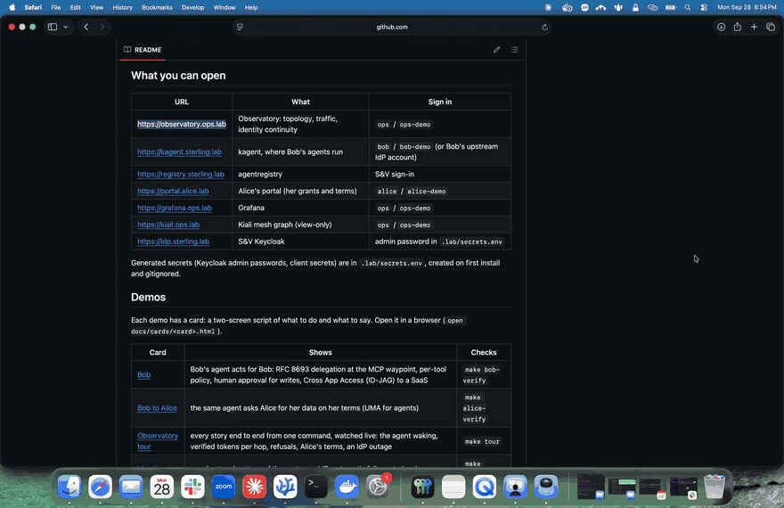
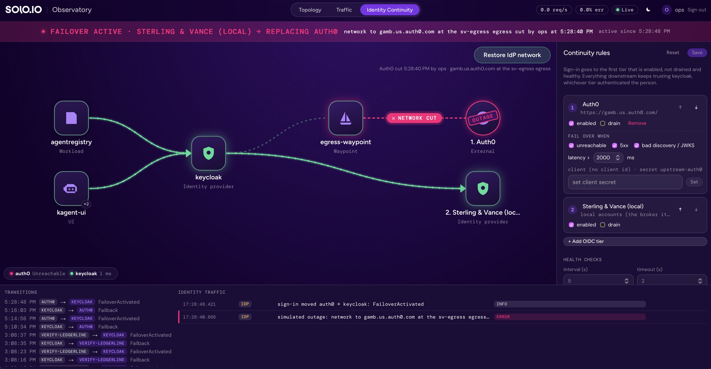

# Identity continuity

Sterling & Vance's broker (Keycloak at `https://idp.sterling.lab`, realm
`sterling-vance`) routes workforce sign-in to an ordered chain of the firm's
IdPs (`ENTERPRISE_IDP`: Okta, Auth0, Gluu, or the Keycloak S&V runs itself)
and maps each into one profile. The broker is not an IdP for the workforce:
it holds no employee passwords, only break-glass accounts for platform admins.
S&V's own services trust only the broker. When an IdP goes down, new sign-ins
move to the next healthy one and nothing downstream changes: same issuer,
same `sub`, same groups. An IdP that issues ID-JAGs (Gluu, S&V's Keycloak)
also vouches for its users to other companies (Cross App Access),
with the same failover
([IDENTITY-FLOWS.md](IDENTITY-FLOWS.md#2-cross-app-access-id-jag-to-a-saas)).

[](videos/identity-continuity.mp4)

- API and controller: `apps/continuity` (`IdentityContinuity`, `continuity.lab.solo.io/v1alpha1`)
- Install: `platform/47-continuity` (`make layer-47`, after `45-identity`)
- Demo card: [cards/identity-continuity.html](cards/identity-continuity.html)
- Checks: `make continuity-verify`

```bash
kubectl --context kind-solo-lab get idc -n sv-identity
```

## The resource

The tiers come from `ENTERPRISE_IDP` in `config/lab.env` (default
`auth0,keycloak`), in any order, then `break-glass`, the broker's own
accounts for platform admins. An IdP without `<NAME>_ISSUER` in `.env` is
left out, so with no Auth0 tenant the lab signs people in through S&V's own
Keycloak. Failback is automatic
(`platform/47-continuity/identitycontinuity.yaml`).

| IdP | Where | Vouches for its users (ID-JAG) |
| --- | --- | --- |
| `okta` | `OKTA_ISSUER`, `OKTA_CLIENT_ID` | no: the broker vouches for those sign-ins |
| `auth0` | `AUTH0_ISSUER`, `AUTH0_CLIENT_ID`, `AUTH0_CLIENT_SECRET` | no: the broker vouches for those sign-ins |
| `gluu` | `GLUU_ISSUER`, `GLUU_CLIENT_ID` ([GLUU.md](GLUU.md)) | yes |
| `keycloak` | S&V's own Keycloak: `https://login.sterling.lab`, realm `workforce`, namespace `sv-workforce` (layer 45), or `KEYCLOAK_ISSUER` | yes |

Every IdP in the chain is trusted for S&V's workforce: a user who signs in
through it is linked to the S&V account with the same verified email. The
broker has an account for each employee, without a password, and never
creates one at sign-in. Chain
only IdPs that are authoritative for S&V's users. Accounts with role
`local-only` (the `platform-admins` group: break-glass and platform admins)
are never linked to an upstream; with every IdP down they are the only ones
who can sign in. Only the active tier's IdP is enabled in
Keycloak; the others keep their users' links but can't sign anyone in, not
even by `kc_idp_hint`.

S&V's broker authenticates to an upstream with `private_key_jwt` (tier
`oidc.clientAuth`), signing with a PS256 realm key kept for that alone; its
public half is in the realm's JWKS and in `make xaa-keys`
(`sv-upstream-client.jwks.json`). An upstream given `<NAME>_CLIENT_SECRET` in
`.env` uses `client_secret_post` instead (the Auth0 setup below).

Each upstream's ServiceEntry is exported to `sv-identity` and to the
namespaces in `spec.egress.exportTo` (`agentgateway-system`, where S&V's
egress has upstreams vouch for users), so every S&V call to an upstream
leaves through `sv-egress/egress-waypoint`, and a partition there cuts all
of them. Cross App Access follows `status.active` the same way sign-in does.

Re-running the layer applies `ENTERPRISE_IDP` and `.env` (which tiers, their
order, issuers, client secrets, token settings). What operators set on a tier
(display name, enabled, failover rules, through the Observatory rule builder
or by hand) is kept.

| `ENTERPRISE_IDP` | Sign-in |
| --- | --- |
| `keycloak` | S&V's own Keycloak |
| `auth0,keycloak` (default) | Auth0, else S&V's own Keycloak |
| `okta,auth0,keycloak` | Okta, else Auth0, else S&V's own Keycloak |
| `keycloak,auth0` | S&V's own Keycloak, else Auth0 |
| `gluu,keycloak` | Gluu, else S&V's own Keycloak ([GLUU.md](GLUU.md)) |

### What the broker realm must already have

The controller manages identity providers and one redirector setting. It
doesn't create flows or roles, so the realm needs them first
(`platform/45-identity/realm-sterling-vance.json` has all of them):

- a browser flow (`continuity-browser`) with an **Identity Provider
  Redirector** execution, bound as the realm's browser flow;
- a first-broker-login flow (`continuity-first-broker-login`) that detects
  the existing user and links automatically (`idp-detect-existing-broker-user`,
  `idp-auto-link`);
- a service-account client whose roles include realm-management
  `manage-identity-providers` and `manage-realm` (editing the redirector's
  config is realm config; so is the user profile), with its credentials in
  the Secret `broker.keycloak.credentialsRef` names;
- for `sync`: a second service-account client with realm-management
  `view-users` and `manage-users` only (`continuity-sync`), its credentials
  in the Secret `sync.credentialsRef` names.

### spec

| Field | Meaning |
| --- | --- |
| `broker.keycloak.url` | in-cluster Keycloak base URL (admin API) |
| `broker.keycloak.realm` | realm to manage |
| `broker.keycloak.credentialsRef` | Secret with `client-id`/`client-secret` of a service-account client with realm-management `manage-identity-providers` and `manage-realm` |
| `broker.keycloak.browserFlow` | browser flow whose Identity Provider Redirector points at the active tier (`continuity-browser`) |
| `broker.keycloak.firstBrokerLoginFlow` | first-broker-login flow for every upstream (`continuity-first-broker-login`: link to the existing user) |
| `egress.namespace`, `egress.waypoint` | route back-channel calls to external upstreams through this waypoint (one ServiceEntry per tier) |
| `egress.internalDomains` | hosts under these domains are in-cluster and get no ServiceEntry |
| `tiers[]` | ordered; the first eligible, healthy tier is active |
| `tiers[].name` | also the Keycloak IdP alias |
| `tiers[].displayName` | shown on the login page and in the Observatory |
| `tiers[].type` | `oidc` (an IdP) or `local` (the broker's own accounts: break-glass) |
| `tiers[].enabled` | `false`: never active, Keycloak IdP disabled |
| `tiers[].drain` | out of rotation; sessions in flight keep working |
| `tiers[].oidc.issuer` | exactly as the upstream publishes it (Auth0's ends in `/`) |
| `tiers[].oidc.clientID` | optional; falls back to the Secret's `client-id` key |
| `tiers[].oidc.clientSecretRef` | Secret and key (default `client-secret`); missing means `NotConfigured` |
| `tiers[].oidc.scopes` | default `openid email profile` |
| `tiers[].attributes[]` | the IdP's attributes paired with S&V's profile for the directory sync: `attribute` (built-in or `profile.attributes`) and `path` (the attribute in the IdP's user record) |
| `tiers[].directory` | where the sync reads and writes this IdP's users: `type` (`scim`, `auth0`, `keycloak`), `url`, `credentialsRef` (`client-secret`, and `client-id` unless `clientID` is set), `scopes`, `audience` (Auth0) |
| `tiers[].failoverWhen` | which probe results count against the tier: `unreachable`, `serverError`, `invalidDiscovery` (each default true), `latencyAboveMs` (must be below `health.timeoutSeconds`: a slower answer times out first) |
| `health` | `intervalSeconds`, `timeoutSeconds`, `unhealthyThreshold` (failures in a row to go down), `healthyThreshold` (successes in a row to come back) |
| `failback` | `Automatic` (move back up as soon as a higher tier is healthy) or `Manual` |
| `profile.attributes[]` | S&V's profile beyond `username`, `email`, `firstName`, `lastName`: `name`, `displayName`, `multivalued` |
| `sync.schedule` | cron, UTC; `sync.suspend` pauses it |
| `sync.credentialsRef` | Secret with the sync's realm client (default `continuity-sync`) |

### status

`active` (where logins go now: the tier Keycloak's redirector points at, or
the local tier), `activeSince`, `broker.issuer`, `egressNamespace`, per tier (`configured`, `healthy`,
`partitioned`, `latencyMs`, `reason`, `message`, consecutive failures and
successes, and `redirectURI`: the callback the upstream app must allow),
the last 20 `transitions`, `sync` (CronJob, last run and last success,
users, S&V profiles updated, failover accounts written and created,
failures), and
conditions `Ready`, `Degraded` (not on the first tier) and `ProfileApplied`. The controller also emits Kubernetes events (`TierHealthy`,
`TierUnhealthy`, failovers).

## What the controller does

Every `health.intervalSeconds`, two replicas, one leader (Lease
`continuity.lab.solo.io` in `sv-identity`):

1. **Probe each tier.** `oidc`: fetch discovery and JWKS within
   `timeoutSeconds`; every endpoint in the discovery document must be https.
   Results: `Healthy`, `Unreachable`, `ServerError`, `InvalidDiscovery`,
   `SlowResponse`. `local`: healthy while Keycloak is reachable. A tier
   without credentials is probed but `NotConfigured`. A probe counts toward
   the thresholds at most once per interval, so editing the spec doesn't
   speed up a failover.
2. **Pick the active tier:** the first that is enabled, not drained,
   configured and healthy. With `failback: Manual` it stays put until the
   current tier fails. With nothing eligible, the first local tier that is
   enabled and not drained. While Keycloak itself is unreachable nothing can
   change, so the active tier holds.
3. **Make Keycloak match**, through its admin API:
   - one OIDC identity provider per configured `oidc` tier (hidden from the
     login page when not eligible), with PKCE S256, `client_secret_post`, and
     a claim filter that only accepts `email_verified: true`. A setting
     changed by hand in Keycloak is put back. If a tier's Secret goes
     missing its IdP stays (hidden), so users' links to it survive; only
     removing the tier from the spec deletes it;
   - the `continuity-browser` flow's IdP redirector set to the active tier,
     or cleared when the active tier is `local`, so the broker's own form
     shows (platform admins only).
4. **Keep the egress path:** a ServiceEntry `sv-egress/continuity-<tier>` for
   each external upstream, bound to `sv-egress/egress-waypoint`, so the
   back-channel (probes, token, JWKS, userinfo) leaves the lab under S&V
   policy. A ServiceEntry of that name owned by another instance is left
   alone (and reported); when `spec.egress` changes or goes away, the old
   ones are removed.

Deleting an IdentityContinuity removes its IdPs and ServiceEntries and
clears the redirector. If Keycloak stays unreachable for 5 minutes, the
controller gives up on Keycloak (event `CleanupAbandoned`) rather than hold
up the deletion.

Users signing in through an upstream are linked to their existing S&V user
by verified email (`idp-detect-existing-broker-user`, `idp-auto-link`), so
`sub` and group membership never change. Each managed IdP carries a username
mapper (`username-from-email`) that makes the brokered username the verified
email, because the first-broker-login lookup matches by email or username:
without it, an upstream account named `bob` would be linked to S&V's Bob
whatever its email.

The controller's RBAC in `sv-identity` is the IdentityContinuity resources, a
Lease, events, and `get` on the Secrets it is configured with, by name
(Role `continuity-controller-secrets`). It cannot list or watch Secrets, so it
never sees Keycloak's own admin or signing-key Secrets. Credentials are re-read
on every reconcile, so a rotated secret takes effect within one interval. The DNS capture that makes the
ServiceEntry apply is Istio ambient's (`AMBIENT_DNS_CAPTURE`, on in 1.31).

## Directory sync

The IdPs in the chain must agree on who each employee is and what their
profile says, so that whichever one is active signs them in with the same
details. The directory sync keeps them in step with the primary, on a
schedule (`spec.sync`), through S&V's profile on the broker:

1. **Primary → S&V's profile.** The chain's first IdP is the primary. For
   each employee the broker has, the sync reads their record from the
   primary's directory and writes the mapped attributes into S&V's profile,
   the standard every IdP maps to.
2. **S&V's profile → each failover.** It then writes S&V's profile to every
   other IdP with a directory, through that IdP's mapping. A user the
   primary has and a failover doesn't is created there, and the failover
   emails them to set their own password (Keycloak's "execute actions"
   email; the realm needs its SMTP settings). A directory that can't create
   a user without a password (Auth0) reports them instead.

Reorder the chain and the roles follow. A user is found at an IdP by the
broker's link to it, else by email (one match, never a guess). After each
write the sync reads the record back, so an attribute the directory drops
is reported. It never reads or writes a password or other credential,
never writes the username, and never deletes a user; accounts with role
`local-only` are left alone. Tokens carry the standard claims only.

```yaml
spec:
  profile:
    attributes: [{name: department, displayName: Department}]
  sync: {schedule: "0 2 * * *"}
  tiers:
  - name: auth0                      # primary: read
    attributes:
    - {attribute: firstName, path: given_name}
    - {attribute: department, path: user_metadata.department}
    directory: {type: auth0, url: https://<tenant>/api/v2, audience: https://<tenant>/api/v2/,
      credentialsRef: {name: directory-auth0}}
  - name: keycloak                   # failover: written
    attributes:
    - {attribute: firstName, path: firstName}
    - {attribute: department, path: department}
    directory: {type: keycloak, url: http://keycloak.sv-workforce.svc/admin/realms/workforce,
      credentialsRef: {name: directory-keycloak}}
```

| Directory | Client | Paths |
| --- | --- | --- |
| `scim` (Gluu, Ping, most enterprise IdPs) | `client_credentials` with the SCIM read and write scopes | `name.givenName`, `emails[primary eq true].value`, `urn:ietf:params:scim:schemas:extension:enterprise:2.0:User:department` |
| `auth0` | Machine-to-Machine app for the Management API, `read:users`, `update:users` | `given_name`, `user_metadata.department`, `app_metadata.<key>` |
| `keycloak` | service-account client with `view-users`, `manage-users` in that realm | `firstName`, `department` (the realm's user profile must keep it, or allow unmanaged attributes) |

Auth0 has no SCIM API for its own users; its Management API is the
directory. **Test connection** (`sync --test-tier <idp>`, a Job from the
CronJob) gets a token, counts the users and reads the directory's attribute
schema along the sync's own path and credentials; its result (never user
records) is the container's termination message.

The sync runs as ServiceAccount `continuity-sync`: `get` on its instance,
`patch` on its status, and `get` on its own Secret and the directories'
Secrets by name (Role `continuity-sync-secrets`). It reaches the broker and
the directories under the same mesh policy as the controller; directory
hosts get ServiceEntries on the IdP's egress path.

## Kill switch

A real network partition. The controller never reads a flag; it only sees
its probes fail.

```yaml
apiVersion: security.istio.io/v1
kind: AuthorizationPolicy
metadata:
  name: continuity-partition-<tier>
  namespace: sv-egress                       # external upstream
  labels: {continuity.lab.solo.io/tier: <tier>}
spec:
  targetRefs: [{group: networking.istio.io, kind: ServiceEntry, name: continuity-<tier>}]
  action: DENY
  rules: [{}]
```

For an upstream inside the lab, the policy goes in that upstream's namespace
without `targetRefs`. Delete the policy to heal. Status marks the tier
`partitioned` for information only.

With the default health settings (5 s interval, 2 failures, 3 successes),
failover takes about 10 s after the cut and failback about 15 s after the heal.

## In the Observatory

**Identity Continuity** tab, one `IdentityContinuity` at a time:




- **Map:** every app that signs people in through the broker (found from the
  edge's SSO configuration), the broker, the egress gateway, and the tiers in
  order. The live path is green.
- **Banner:**

| State | Banner |
| --- | --- |
| first tier active | green: `CONNECTED · <tier> SIGNING PEOPLE IN` |
| cut, not failed over yet | amber, pulsing: `OUTAGE · <tier> UNREACHABLE · FAILING OVER`, with failed checks counted |
| failed over | red, pulsing: `FAILOVER ACTIVE · <active> → REPLACING <first>`, with who cut what and when |
| healed, verifying | amber: `NETWORK RESTORED · VERIFYING <tier> BEFORE FAILING BACK`, with healthy checks counted |
| no healthy tier | red: `SIGN-IN UNAVAILABLE · NO HEALTHY TIER` |

- **Simulate IdP outage / Restore IdP network:** creates or deletes the kill
  switch policy for the active upstream (a picker appears with more than one
  upstream). The cut wire reads `NETWORK CUT`, the tier is stamped `OUTAGE`,
  and the egress gateway turns red. The policy records who cut it.
- **Rule builder** (right): IdP order, enable, drain, failover conditions,
  latency limit, client secrets (write-only), new OIDC IdPs (the redirect URI
  to register is shown), health settings, failback. Save applies the spec as
  you.
- **Directory sync** (from the rule builder): the IdPs in chain order on
  the left (primary, failovers), S&V's profile on the right. Each IdP lists
  its attributes (its directory's usual ones, the schema Test connection
  reads, or added with **+**); wire them to the S&V attributes they pair
  with. Each IdP's directory has **Test connection** (the saved settings,
  run as the sync). **Code** edits the same mapping as JSON, each S&V
  attribute and the IdPs' attributes paired with it, in chain order
  (`"department": ["auth0.user_metadata.department", "keycloak.department"]`);
  **Schedule** sets the sync's cron, pauses it, shows the last run and runs
  it now. Directory credentials are write-only and readable by the sync
  alone.
- **Transitions** and **Identity traffic** (bottom): failovers, cuts and
  restores, and OIDC calls.

## Auth0 setup

Tenant: `AUTH0_ISSUER` in `.env`, your tenant's issuer with its trailing
slash (`https://<tenant>.us.auth0.com/`). Unset, the lab has no auth0 tier.

1. **Applications → Create Application → Regular Web Application.** Settings:

   | Field | Value |
   | --- | --- |
   | Allowed Callback URLs | `https://idp.sterling.lab/realms/sterling-vance/broker/auth0/endpoint` |
   | Allowed Logout URLs | `https://idp.sterling.lab/realms/sterling-vance/broker/auth0/endpoint/logout_response` |
   | Credentials → Authentication Method | Client Secret (Post) |
   | Advanced → Grant Types | Authorization Code |

   The `.lab` hosts only resolve on your machine. That's fine: Auth0 only
   redirects the browser to them.

2. **Connections:** enable only Username-Password-Authentication. In
   Authentication → Database → Username-Password-Authentication, turn on
   **Disable Sign Ups**.

3. **Create the user** `bob@sterling.lab` with a password of your choice, and
   **mark the email verified** (edit the email on the user's page, or
   `PATCH /api/v2/users/{id}` with `{"email_verified": true}` from the
   Management API Explorer). Unverified emails are refused at Keycloak.

4. **Give the lab the tenant and credentials** in `.env` (`auth0` is in the
   default `ENTERPRISE_IDP`), then install the layer again:

   ```
   AUTH0_ISSUER=https://<tenant>.us.auth0.com/
   AUTH0_CLIENT_ID=<Client ID>
   AUTH0_CLIENT_SECRET=<Client Secret>
   ```

   ```bash
   make layer-47
   ```

   This writes Secret `sv-identity/upstream-auth0`. Within three probes the
   tier is healthy and, with automatic failback, active:

   ```bash
   kubectl --context kind-solo-lab get idc sterling-vance -n sv-identity -o jsonpath='{.status.active}'
   ```

Bob's groups come from his S&V account, not from Auth0.

**Auth0 as a directory** (the directory sync): **Applications → Create
Application → Machine to Machine Applications**, authorized for the **Auth0
Management API** with `read:users` and `update:users`. Its credentials in
`.env`, then `make layer-47`:

```
AUTH0_DIRECTORY_CLIENT_ID=<Client ID>
AUTH0_DIRECTORY_CLIENT_SECRET=<Client Secret>
```

This writes Secret `sv-identity/directory-auth0` and sets the auth0 IdP's
directory (`https://<tenant>/api/v2`); map its attributes in the
Observatory's Directory sync.

## Gluu setup

Gluu as S&V's enterprise IdP: [GLUU.md](GLUU.md#sv-enterprise-idp-gluu).

## S&V's own Keycloak

`keycloak` in `ENTERPRISE_IDP` is a Keycloak S&V runs itself, apart from the
broker: layer 45 installs one in `sv-workforce` at
`https://login.sterling.lab`, realm `workforce`, with the employees
(`bob` / `bob-demo`, `carol` / `carol-demo`). It is an upstream like the
others: S&V's client there (`sterling-vance-broker`) authenticates with the
broker's key and the egress's key (`private_key_jwt`), it issues ID-JAGs for
the broker's sign-ins, and the profile sync reads its users with
`continuity-directory` (`view-users`) over its admin API, which only the
sync reaches. To use another Keycloak, set `KEYCLOAK_ISSUER` and
`KEYCLOAK_CLIENT_ID` in `.env` and register the callback and keys as for any
upstream.

## Okta setup

`OKTA_ISSUER` (your org's authorization server, e.g.
`https://<org>.okta.com`) and `OKTA_CLIENT_ID` in `.env`, `okta` in
`ENTERPRISE_IDP`. An OIDC web app integration: sign-in redirect URI
`https://idp.sterling.lab/realms/sterling-vance/broker/okta/endpoint`,
client authentication with a public key (the JWKS from `make xaa-keys`,
`sv-upstream-client.jwks.json`), grant type Authorization Code, PKCE
required. In Cross App Access the broker vouches for Okta sign-ins.

## Another upstream IdP

Any OIDC provider works (Entra ID, Ping, another Keycloak). In the
rule builder, **Add OIDC tier**: name, display name, issuer, client ID and
secret. Register `<broker issuer>/broker/<name>/endpoint` as the app's
callback (shown in the form and in `status.tiers[].redirectURI`), allow
`openid email profile`, use `client_secret_post`, and make sure the IdP
sends `email_verified: true` for the user. The rule builder also grants the
controller read access to the new tier's Secret. Editing `spec.tiers` by hand,
create the Secret and add its name to Role `sv-identity/continuity-controller-secrets`
(the controller reads Secrets by name only, and never lists or watches them).

## Checks

`make continuity-verify` runs the loop on a scratch tier pointed at an issuer
the lab already runs (Ledgerline's Keycloak), then restores the spec:
controller health and leadership, a tier added at runtime, failover by
partition, failback on heal, live rule changes, cleanup of a removed tier,
and, when Auth0 is configured, the egress partition on `continuity-auth0`
and a browser sign-in landing on Auth0. Bob's Auth0 sign-in itself is
interactive and is skipped.

## Troubleshooting

| Symptom | Cause |
| --- | --- |
| tier `NotConfigured` | `AUTH0_CLIENT_ID`/`AUTH0_CLIENT_SECRET` missing from `.env`, or `make layer-47` not re-run |
| Auth0: callback URL mismatch | the callback isn't exactly `status.tiers[].redirectURI` |
| Keycloak: "does not match the configured essential claim" | the user's email isn't verified at the upstream (`email_verified: false`) |
| Keycloak: `invalid_client` | Authentication Method isn't Client Secret (Post), or the secret is stale |
| outage button: "no network path is known" | no ServiceEntry for the tier: `spec.egress` unset, or the tier is `local` |
| cut has no effect | the caller isn't in the ambient mesh, or DNS capture is off, so traffic bypasses the ServiceEntry |
| stays on local after a heal | failback waits for `healthyThreshold` successes; `Manual` failback never moves back |
| `ProfileApplied` False: maps to "x", not in the profile | add the attribute to S&V's profile, or fix the mapping |
| sync: `directory token: HTTP 401` | the directory client's credentials, or it lacks `client_credentials` |
| sync: `directory: HTTP 403` | the directory client lacks the read scope (`scopes`) or Auth0 `read:users` |
| sync failed, attribute unchanged | that tier's directory was unreachable; its attributes are kept until the next run |

Keycloak's log names the claim or step that failed:

```bash
kubectl --context kind-solo-lab -n sv-identity logs deploy/keycloak --since=10m | grep -i -E "claim|IDENTITY_PROVIDER"
```
