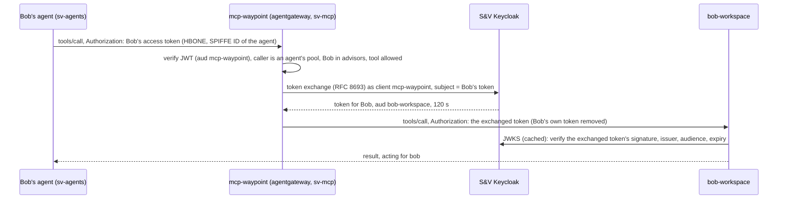
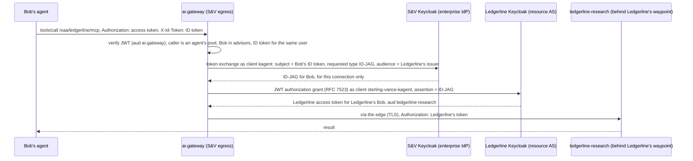
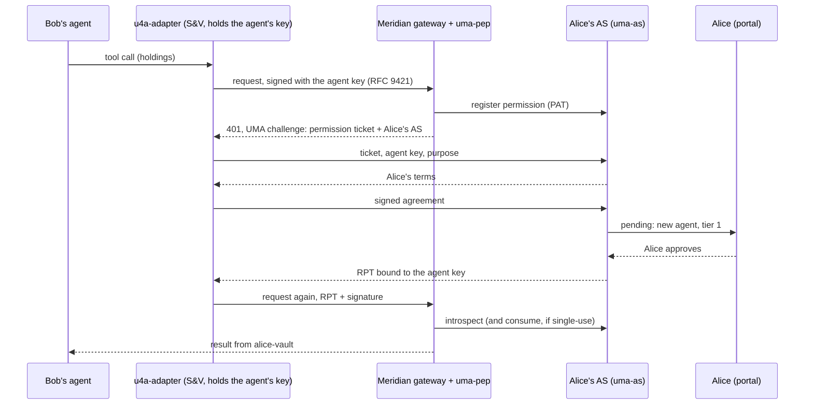

# Identity flows

The three ways an agent gets access in this lab, from the token in the
browser to the call the tool receives. Each section covers who takes part,
the token at each hop, the policy that decides, the patches it needs, and
what the checks prove.

| Flow | Question it answers | Demo card | Checks |
| --- | --- | --- | --- |
| [Delegation](#1-delegation-rfc-8693-at-the-mcp-waypoint) | how does Bob's agent act for Bob on the firm's own tools? | [Bob](cards/bob.html) | `make bob-verify` |
| [Cross App Access](#2-cross-app-access-id-jag-to-a-saas) | how does it reach a SaaS the firm subscribes to, as Bob? | [Bob](cards/bob.html) | `make bob-verify` |
| [UMA for agents](#3-uma-for-agents-bob-to-alice) | how does it reach data owned by someone outside the firm, on their terms? | [Bob to Alice](cards/bob-to-alice.html) | `make alice-verify` |

In every flow two identities are checked: the **workload** (the agent's SPIFFE
ID, from the mesh) and the **user** (Bob, from a token). Neither alone is enough.
The agent holds no credential of its own: no model key, no tool token, no
cross-company token.

## Where the user's tokens come from

1. Bob opens `https://kagent.sterling.lab`. The kgateway edge runs the OIDC
   code flow against S&V's Keycloak (client `kagent`,
   `platform/60-kagent/edge-sso.yaml`) and keeps two cookies:
   - `BearerToken`: Bob's **access token**, audiences `ai-gateway` and
     `mcp-waypoint`. The edge forwards it to kagent as `Authorization`.
   - `IdToken`: Bob's **ID token**, issued to `kagent`.
2. The kagent controller runs in trusted-proxy mode: it takes the user from
   the forwarded token without checking its signature, so the mesh admits
   only the UI (which forwards what the edge verified) and the agents' worker
   pools ([ARCHITECTURE.md](ARCHITECTURE.md#what-the-lab-doesnt-enforce)). It
   passes `Authorization` to the agent on each A2A turn. With `tools/kagent` patch 0001 it also passes `X-Id-Token`, but only
   when that ID token is bound to the same user: same `sub`, issued to
   `kagent`, not expired.
3. The agent (`sv-agents/bob-assistant`, a SandboxAgent on Agent Substrate)
   forwards `Authorization` on every tool call (`KAGENT_PROPAGATE_TOKEN`), and
   `X-Id-Token` only to the tools that list it in `allowedHeaders`.

The edge forwards the access token, not the ID token, because Keycloak's
standard token exchange only accepts an access token as its subject.

## 1. Delegation (RFC 8693) at the MCP waypoint

Bob's workspace (`sv-mcp/bob-workspace`, a kmcp server) never sees Bob's
token. The waypoint in front of it verifies Bob and the agent, then swaps
Bob's token for one only the workspace accepts, for two minutes.

In RFC 8693's terms the swap is *impersonation*, not delegation: the
waypoint sends only a subject token (Bob's), so the new token names Bob and
has no `act` claim for the agent. Which agent is calling is established by
the mesh (the worker pool's SPIFFE ID, checked at the waypoint), not
recorded in the token. Keycloak's standard token exchange doesn't take an
actor token yet; with one, the token would carry `act: {sub: <agent>}`.

- **Path.** The agent calls the tool's own address,
  `bob-workspace-mcp.sv-mcp:3000`. Ambient mesh sends every call to that
  Service through the namespace's waypoint (an agentgateway), so no route
  skips it. Pods behind it take connections from the waypoint only.
- **User lane** (a bearer token is present), all in
  `demos/bob/manifests/20-waypoint.yaml`:
  - JWT, strict: issuer `https://idp.sterling.lab/realms/sterling-vance`,
    audience `mcp-waypoint`.
  - Authorization: the caller is an agent's worker pool, named by
    ServiceAccount (`bob-assistant` or `advisor-desk` in `sv-agents`), and
    `"advisors" in jwt.groups`. Another workload in `sv-agents` holding
    Bob's token is refused.
  - Per-tool CEL: advisors get `whoami`, `list_clients`, `get_client`,
    `get_meeting_notes`, `log_followup`. `export_book` needs group
    `compliance` (no user in the lab is in it; add one in S&V's Keycloak to
    try it), and a tool the caller may not use is removed from
    `tools/list`, so the agent is never shown it.
  - Backend auth: `oauthTokenExchange` against S&V's Keycloak as client
    `mcp-waypoint`, with subject `jwt.rawToken.unredacted()`, audience
    `bob-workspace`. The client's token lifespan is 120 s.
  - The workspace verifies that token itself (signature against S&V's JWKS,
    issuer, audience `bob-workspace`, expiry) before any tool runs, so a
    forged or replayed token is refused even if something reached the pod.
- **Discovery lane** (no token): only the kagent controller's SPIFFE ID, so
  the UI can list tools. Same tool filter, no exchange, and the route strips
  `Authorization` and `X-Id-Token`, so nothing that looks like a credential
  reaches the workspace on it. A tool call here has no delegated token and
  the workspace refuses it.
- **Writes wait for Bob.** `log_followup` is in the agent's
  `requireApproval`, so the agent pauses for his approval in the chat. The
  entry records the user (`bob`) and the party that carried it out
  (`mcp-waypoint`).

Checks (`make bob-verify`, from real pods with their own identities):

| Case | Expected |
| --- | --- |
| an S&V agent workload with Bob's token lists tools, calls `whoami`, `list_clients` | allowed; `acting_for: bob`, `audience: bob-workspace` |
| `export_book` as an advisor | not in the list; refused |
| an S&V agent workload with no user token | refused (discovery lane is controller-only) |
| Bob's token from another namespace (`observability`) | refused |
| Bob's token from a workload in `sv-agents` that isn't an agent's pool | refused |
| Bob's token sent straight to a workspace pod IP | refused (the pod only accepts the waypoint) |

## 2. Cross App Access (ID-JAG) to a SaaS

Ledgerline Research is a SaaS S&V subscribes to, a separate company with its
own IdP. Bob's agent uses Ledgerline as Bob, with no consent screen and no
shared credential. S&V's IdP vouches for Bob to Ledgerline for one approved
connection, and Ledgerline issues its own short-lived token. Both exchanges
happen at the firm's egress gateway, so the agent never holds either token.

- **Requesting side** (`demos/bob/manifests/40-xaa-ledgerline.yaml`):
  - Route `xaa-ledgerline` on ai-gateway, matched only with a bearer token.
  - JWT, strict, audience `ai-gateway`. Authorization: the caller is an
    agent's worker pool (by ServiceAccount), `"advisors" in jwt.groups`, and
    an `x-id-token` whose subject is the access token's
    (`unvalidatedJwtPayload(request.headers["x-id-token"]).sub == jwt.sub`).
    The gateway only reads the ID token's subject; S&V's Keycloak verifies
    its signature when it exchanges it, and issues an ID-JAG only for an ID
    token issued to `kagent`.
  - Backend auth `crossAppAccess`, authenticating to S&V's Keycloak as
    client `kagent` (Secret `agentgateway-system/kagent-client`): in Cross
    App Access the requesting app is the one Bob signed into, and Keycloak
    issues an ID-JAG only for an ID token issued to that client. Subject from
    header `x-id-token`, type ID token; scopes `xaa-ledgerline research:read`; `accessTokenScopes: []`
    so those scopes aren't sent on to Ledgerline.
  - The agent's tool (`RemoteMCPServer ledgerline-research`) points at
    `ai-gateway/xaa/ledgerline/mcp` and lists `x-id-token` in
    `allowedHeaders`, so only this tool receives Bob's ID token.
- **Enterprise IdP** (S&V Keycloak, realm `sterling-vance`):
  - Built from `tools/keycloak-idjag`: Keycloak 26.7.4 with
    keycloak/keycloak#49998, which adds ID-JAG issuing to the token endpoint.
    Stock Keycloak can receive ID-JAGs but not issue them.
  - Client `kagent` has standard token exchange enabled and the optional
    scope `xaa-ledgerline`. That scope adds a hardcoded
    `client_id=sterling-vance-kagent` claim (S&V's client at Ledgerline) and
    Ledgerline's issuer as audience. The connection exists because the firm
    approved this scope for this client.
  - An ID-JAG is only issued for an ID token issued to the requesting client
    (`kagent`), which is why the ID token has to reach the gateway at all
    (patch 0001).
- **Resource AS** (Ledgerline Keycloak, realm `ledgerline`, feature
  `identity-assertion-jwt`, `demos/bob/ledgerline/realm-ledgerline.json`):
  - Identity provider `sterling-vance` trusts S&V's issuer and JWKS, with JWT
    authorization grant on, assertion reuse off, and assertions valid for at
    most 300 s.
  - Client `sterling-vance-kagent` may use the JWT authorization grant with
    that IdP.
  - Ledgerline's own user `bob@sterling.lab` is linked to S&V's `sub`, so
    Ledgerline knows him as its own account.
- **Resource server** (`demos/bob/ledgerline/research.yaml`): a standard Istio
  waypoint, not an AI gateway. It accepts tokens from Ledgerline's issuer
  only, with audience `ledgerline-research`, and only from the edge. The tool
  catalog is public; every tool call needs a Ledgerline token, which the
  server verifies again against Ledgerline's JWKS.
- **Discovery lane:** the kagent controller's SPIFFE ID may list Ledgerline's
  public catalog through `/xaa/ledgerline` without a user. The route strips
  `Authorization` and `X-Id-Token`, and it can never get a Ledgerline token.

Checks (`make bob-verify`):

| Case | Expected |
| --- | --- |
| `account_info` with Bob's tokens from an S&V agent workload | Ledgerline's own account for Bob |
| `sector_outlook` through XAA | result |
| no ID token | refused at the egress gateway |
| right tokens, wrong workload (`observability`) | refused |
| Bob's access token with another user's ID token | refused at the egress gateway |
| Bob's S&V token sent straight to `mcp.ledgerline.lab` | refused by Ledgerline |

## 3. UMA for agents (Bob to Alice)

Alice's portfolio is held by Meridian Wealth, her brokerage, and it's her
data. Bob's firm doesn't hold it, and Meridian can't decide who reads it.
Alice's own authorization server (UMA 2.0) holds her terms. Meridian's
gateway asks that server on every call, and Bob's agent has to earn a grant
on her terms, bound to a key only it holds.

The protocol profile, its services and their tests are in
[uma4agents](https://github.com/nickgamb/uma4agents) (`docs/PROTOCOL.md`,
`docs/ARCHITECTURE.md`). This lab runs those services as separate parties
behind the mesh, built from that repository at `U4A_TAG`
(`demos/bob-to-alice/install.sh`).

- **Parties** (`demos/bob-to-alice`):
  - S&V: `sv-u4a/u4a-adapter`, the UMA client. It holds the agent's Ed25519
    key (a fresh one per pod, so the agent is pseudonymous to Alice) and runs
    ticket, terms, agreement, and RPT for the agent. Only Bob's agent and the
    kagent controller can reach it. It agrees to Alice's terms on the agent's
    behalf by itself, within `UMA4A_STANDING_MAX_EXPIRES` (7 days): no person
    at S&V signs each agreement, and it doesn't know which user a call is
    for ([ARCHITECTURE.md](ARCHITECTURE.md#what-the-lab-doesnt-enforce)).
  - Meridian: its gateway (agentgateway), `uma-pep` (ext-auth: challenges,
    introspection, proof-of-possession checks, tool-to-resource scoping,
    single-use consumption) and `alice-vault` (a stock MCP server with no
    auth code). The gateway is reachable from the edge only; the vault from
    the gateway and Alice's portal only.
  - Alice: `alice/uma-as` (her authorization server and its Postgres, run by
    CloudNativePG), `alice/portal`, and her IdP (`alice-identity`, realm
    `alice`). Her grant surface is reachable through the edge only; her owner
    API only from her portal, or with her own token.
- **Every cross-party hop crosses the edge**, the way separate companies
  meet on the internet: adapter to Meridian, Meridian to Alice's AS, adapter
  to Alice's AS.
- **Her terms, by tier:**

| Tier | Resource | Her default | What the agent gets |
| --- | --- | --- | --- |
| 1 | holdings | approve on first contact, then standing | a grant covered by her terms |
| 2 | transactions | approve once per tier | the same, for this tier |
| 3 | trades | ask me, every time | a single-use grant for that one operation |

  An agent with no standing connection is held on first contact whatever the
  tier. Revoking the agent in her portal kills every token it holds; its next
  request starts over as a stranger.
- **Proof of possession.** An RPT is bound to the agent's key, and every
  request is signed (RFC 9421). A copied RPT is useless without the key.
- **What stays where.** Meridian enforces Alice's terms without reading them.
  S&V never sees Alice's credentials, and Alice never needs to know how S&V
  identifies its agent.

Checks (`make alice-verify`):

| Case | Expected |
| --- | --- |
| tier 1, first contact | held for Alice; approved; holdings returned |
| tier 2 | held at the new tier, approved, history returned; asked again, it goes through on her standing terms |
| tier 3 trade | held; Alice denies; nothing executed |
| a call to Meridian with no grant | 401 with a UMA challenge |
| Alice's owner API without her token | refused |
| another S&V workload using Bob's agent's adapter | refused (mesh) |
| straight to Alice's vault, skipping Meridian's gateway | refused (mesh) |
| straight to Alice's AS, skipping the edge | refused (mesh) |

`make reset` clears Alice's grants, ledger and terms, and gives the adapter a
new agent key, so the next run starts as a first contact.

## Patches these flows need

| Patch | Needed for | Why |
| --- | --- | --- |
| `tools/kagent` 0001 | Cross App Access | forwards the user's ID token to agents, bound to that user |
| `tools/kagent` 0002 | all three | Substrate actors call the kagent controller back with the caller's credential (they have no ServiceAccount token) |
| `tools/kagent` 0003 | writes that wait for approval, UMA holds | a turn sent as the last one closes (after a human approval) no longer races the actor's suspend |
| `tools/substrate-mesh` 0001, 0002 | all three | a worker pool runs as its agent's ServiceAccount, so the agent's calls carry that SPIFFE ID (which the waypoint, ai-gateway and the adapter check), and only serves its own namespace |
| `tools/substrate-mesh` 0003 | all three | actors work under the mesh's in-pod traffic capture |
| `tools/keycloak-idjag` | Cross App Access | ID-JAG issuing (keycloak/keycloak#49998) |

## Seeing them in the Observatory

- **Topology, Identity view:** the IdPs, SSO links, token-exchange hops and
  gateways that check tokens, with each agent's path to its tools.
- **Traffic, Carries a token:** each request's verified claims at the gateway
  that checked them: at `mcp-waypoint` and `ai-gateway`, Bob's access token
  (issuer, audience, groups, expiry). Exchanged tokens are minted
  after the log point and aren't shown.
