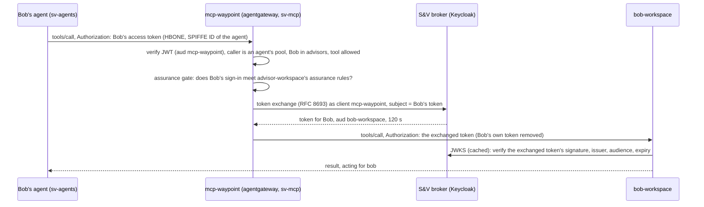
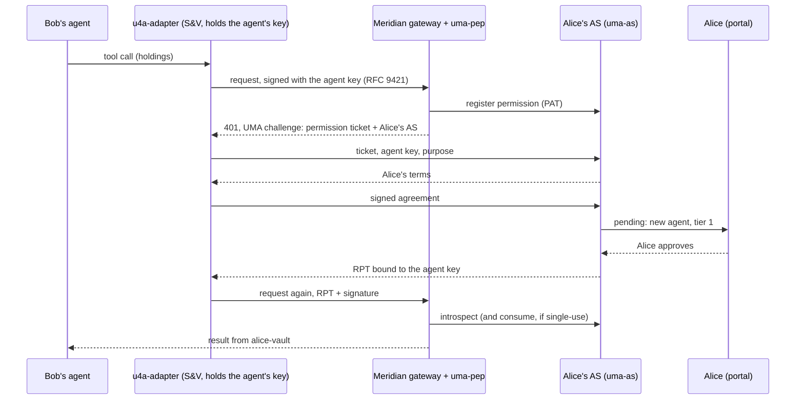

# Identity flows

The three ways an agent gets access in this lab, from the token in the
browser to the call the tool receives. Each section covers who takes part,
the token at each hop, the policy that decides, the patches it needs, and
what the checks prove.

| Flow | Question it answers | Demo card | Checks |
| --- | --- | --- | --- |
| [Delegation](#1-delegation-rfc-8693-at-the-mcp-waypoint) | how does Bob's agent act for Bob on the firm's own tools? | [Bob](cards/bob.html) | `make bob-verify` |
| [Cross App Access](#2-cross-app-access-id-jag-to-a-saas) | how does it reach a SaaS the firm subscribes to, as Bob? | [Bob](cards/bob.html) | `make bob-verify` |
| [UMA for agents](#3-uma-for-agents-bob-to-alice) | how does it reach data owned by someone outside the firm, on their terms? | [Bob to Alice](cards/bob-to-alice.html) | `make alice-verify` |

In every flow two identities are checked: the **workload** (the agent's SPIFFE
ID, from the mesh) and the **user** (Bob, from a token). Neither alone is enough.
The agent holds no credential of its own: no model key, no tool token, no
cross-company token.

## Where the user's tokens come from

1. Bob opens `https://kagent.sterling.lab`. The kgateway edge runs the OIDC
   code flow against S&V's broker (realm `sterling-vance`, client `kagent`,
   `platform/60-kagent/edge-sso.yaml`) and keeps two cookies:
   - `BearerToken`: Bob's **access token**, audiences `ai-gateway` and
     `mcp-waypoint`, plus claim `idp` (the IdP of the
     session) and what that IdP asserted about the sign-in (`idp_acr`,
     `idp_amr`, `idp_auth_time`). The edge forwards it to kagent as
     `Authorization`.
   - `IdToken`: Bob's **ID token**, issued to `kagent`. It stays at the edge.
2. The kagent controller passes `Authorization` to the agent on each A2A turn,
   and nothing else of Bob's.
   - OSS kagent runs in trusted-proxy mode: it takes the user from the
     forwarded token without checking its signature, so the mesh admits only
     the UI (which forwards what the edge verified) and the agents' worker
     pools ([ARCHITECTURE.md](ARCHITECTURE.md#what-the-lab-doesnt-enforce)).
   - kagent-enterprise verifies the token against S&V's broker itself
     ([ENTERPRISE.md](ENTERPRISE.md)).
3. The agent (`sv-agents/bob-assistant`, a SandboxAgent on Agent Substrate)
   forwards `Authorization` on every tool call (`KAGENT_PROPAGATE_TOKEN`).

The agent never holds Bob's ID token. The one flow that needs it, Cross App
Access (section 2), has the egress gateway get it from S&V's broker, which
vouches for Bob. The edge forwards the access token because Keycloak's
standard token exchange only accepts an access token as its subject.

## 1. Delegation (RFC 8693) at the MCP waypoint

Bob's workspace (`sv-mcp/bob-workspace`, a kmcp server) never sees Bob's
token. The waypoint in front of it verifies Bob and the agent, then swaps
Bob's token for one only the workspace accepts, for two minutes.

In RFC 8693's terms the swap is *impersonation*, not delegation: the
waypoint sends only a subject token (Bob's), so the new token names Bob and
has no `act` claim for the agent. Which agent is calling is established by
the mesh (the worker pool's SPIFFE ID, checked at the waypoint), not
recorded in the token. Keycloak's standard token exchange doesn't take an
actor token yet; with one, the token would carry `act: {sub: <agent>}`.



- **Path.** The agent calls the tool's own address,
  `bob-workspace-mcp.sv-mcp:3000`. Ambient mesh sends every call to that
  Service through the namespace's waypoint (an agentgateway), so no route
  skips it. Pods behind it take connections from the waypoint only.
- **User lane** (a bearer token is present), all in
  `demos/bob/manifests/20-waypoint.yaml`:
  - JWT, strict: issuer `https://idp.sterling.lab/realms/sterling-vance`,
    audience `mcp-waypoint`.
  - Authorization: the caller is an agent's worker pool, named by
    ServiceAccount (`bob-assistant` or `advisor-desk` in `sv-agents`), and
    `"advisors" in jwt.groups`. Another workload in `sv-agents` holding
    Bob's token is refused.
  - Per-tool CEL: advisors get `whoami`, `list_clients`, `get_client`,
    `get_meeting_notes`, `log_followup`. `export_book` needs group
    `compliance` (no user in the lab is in it; add one to group `compliance`
    at the broker, realm `sterling-vance`, to try it), and a tool the caller may not use is removed from
    `tools/list`, so the agent is never shown it.
  - Workload profile `advisor-workspace` (Critical, AAL2): the same policy
    asks the assurance gate (`extAuth`, fail closed) with the verified
    token's claims about the sign-in. A session that can't meet it is
    refused before anything is exchanged: 401 with an RFC 9470 challenge
    when a stronger sign-in at the IdP would pass, 403 when the profile
    doesn't take sessions from that IdP
    ([IDENTITY-CONTINUITY.md](IDENTITY-CONTINUITY.md#the-assurance-gate)).
  - Backend auth: `oauthTokenExchange` against S&V's broker as client
    `mcp-waypoint`, with subject `jwt.rawToken.unredacted()`, audience
    `bob-workspace`. The client's token lifespan is 120 s.
  - The workspace verifies that token itself (signature against the broker's JWKS,
    issuer, audience `bob-workspace`, expiry) before any tool runs, so a
    forged or replayed token is refused even if something reached the pod.
  - Tool output: every `tools/call` result goes through `mcp-guard`
    (`apps/mcp-guard`, an agentgateway MCP guardrail, ExtMCP over gRPC)
    before the agent sees it. Account numbers (runs of 8 to 17 digits) and
    SSNs in the result's text and `structuredContent` are masked to their
    last four (`••••8265`). The guard logs the tool and how many values it
    masked, never the values. `failureMode: FailClosed` with a 5 s deadline:
    no answer from the guard, no result. Only the waypoint can reach it
    (`demos/bob/manifests/25-mcp-guard.yaml`).
- **Discovery lane** (no token): only the kagent controller's SPIFFE ID, so
  the UI can list tools. Same tool filter, no exchange, and the route strips
  `Authorization` and `X-Id-Token`, so nothing that looks like a credential
  reaches the workspace on it. A tool call here has no delegated token and
  the workspace refuses it.
- **Writes wait for Bob.** `log_followup` is in the agent's
  `requireApproval`, so the agent pauses for his approval in the chat. The
  entry records the user (`bob`) and the party that carried it out
  (`mcp-waypoint`).

Checks (`make bob-verify`, from real pods with their own identities):

| Case | Expected |
| --- | --- |
| an S&V agent workload with Bob's token lists tools, calls `whoami`, `list_clients` | allowed; `acting_for: bob`, `audience: bob-workspace` |
| `get_client` for a client with an account number | the record, account number masked to its last four by the waypoint's guardrail |
| `export_book` as an advisor | not in the list; refused |
| an S&V agent workload with no user token | refused (discovery lane is controller-only) |
| Bob's token from another namespace (`observability`) | refused |
| Bob's token from a workload in `sv-agents` that isn't an agent's pool | refused |
| Bob's token sent straight to a workspace pod IP | refused (the pod only accepts the waypoint) |
| Bob's sign-in at S&V's own Keycloak (password and one-time code) | allowed: AAL2 meets `advisor-workspace` |
| S&V's own Keycloak cut, Bob's new sign-in at the contingency IdP (password only) | refused: 401 `insufficient_user_authentication`, AAL1 below AAL2 |
| his AAL2 session from before the outage | allowed (the profile takes any allowed IdP's sessions) |

## 2. Cross App Access (ID-JAG) to a SaaS

Ledgerline Research is a SaaS S&V subscribes to, a separate company with its
own authorization server. Bob's agent uses Ledgerline as Bob, with no consent
screen and no shared credential. S&V's broker vouches for Bob to
Ledgerline for one approved connection, and Ledgerline issues its own
short-lived token. Every exchange happens at the firm's egress, so the agent
holds only Bob's S&V access token: never an ID token, the ID-JAG or
Ledgerline's token.

Two settings in `config/lab.env` (`scripts/idp.sh`):

| Setting | Values | Decides |
| --- | --- | --- |
| `ENTERPRISE_IDP` | `auth0,keycloak,contingency` (default), `gluu,auth0,keycloak,contingency`, `okta,keycloak`, ...; any order | S&V's IdPs, which sign Bob in, in failover order ([IDENTITY-CONTINUITY.md](IDENTITY-CONTINUITY.md)); `keycloak` is the Keycloak S&V runs itself (`https://login.sterling.lab`) |
| `RESOURCE_AS` | `keycloak` (default), `gluu`, any name with `LEDGERLINE_<NAME>_ISSUER` | Ledgerline's authorization server |

Each is configured by name ([IDPS.md](IDPS.md)).

S&V's broker vouches for every S&V user, whichever IdP signed them in.
Ledgerline trusts that one issuer and never learns S&V's IdP chain. The
ID-JAG's `sub` is Bob's broker account, the same across failover. The broker
records the IdP a session came from, and kagent's access token carries it
(`idp`).

| Bob's session | Vouches |
| --- | --- |
| any IdP in the chain (Gluu, Okta, Auth0, S&V's own Keycloak, ...), while it is S&V's active IdP | S&V's broker |
| the broker's break-glass accounts (platform admins) | S&V's broker |
| an IdP that is no longer active (failed over, drained) | nobody: refused until Bob signs in again |

Failover is the continuity controller's decision alone (`status.active`).
An upstream that isn't active is disabled at the broker (no sign-in through
it, even by hint) and never called. Every S&V call to an upstream leaves
through `sv-egress`, so cutting an upstream there cuts all of them. Cross
App Access calls no upstream: the broker vouches from Bob's session there,
and the assurance gate refuses a session from an IdP that is no longer
active. Ledgerline tokens already issued live out their five minutes in the
gateway's cache.

```mermaid
sequenceDiagram
  participant A as Bob's agent
  participant G as ai-gateway (S&V egress)
  participant X as idtoken-exchange (ext_proc)
  participant K as S&V broker (Keycloak)
  participant L as Ledgerline AS (Keycloak or Gluu)
  participant M as ledgerline-research (behind Ledgerline's MCP gateway)
  A->>G: tools/call /xaa/ledgerline/mcp, Authorization: Bob's access token
  G->>G: verify JWT (aud ai-gateway), caller is an agent's pool, Bob in advisors; assurance gate
  G->>X: request headers, verified token as metadata
  X->>K: token exchange (RFC 8693) as kagent: Bob's ID token
  X-->>G: x-id-token (replaces any the caller sent)
  G->>G: IdP leg (/xaa-legs/ledgerline/idp/token): verify the ID token, only this exchange, audience and scopes
  G->>K: token exchange: subject = Bob's ID token, requested type ID-JAG, as kagent
  K-->>G: ID-JAG for Bob's broker account, for this connection only
  G->>G: Ledgerline leg (/xaa-legs/ledgerline/as/token): verify the ID-JAG against the broker, typ, client_id, lifetime, scopes
  G->>L: JWT authorization grant (RFC 7523), scope research:read, private_key_jwt as sterling-vance-kagent
  L-->>G: Ledgerline access token for Ledgerline's Bob, aud ledgerline-research, scope research:read
  G->>M: via the edge (TLS), Authorization: Ledgerline's token
  M-->>A: result
```

- **Requesting side** (`demos/bob/manifests/xaa/`): agentgateway makes and
  checks every token request; the lab adds only `idtoken-exchange`.
  - Route `xaa-ledgerline` on ai-gateway, matched only with a bearer token,
    to backend `xaa-ledgerline`.
  - JWT, strict, audience `ai-gateway`. Authorization: the caller is an
    agent's worker pool (by ServiceAccount) and `"advisors" in jwt.groups`.
  - Workload profile `ledgerline-research` (High, AAL2, sessions from the
    active IdP only): the assurance gate decides before the ID token is
    fetched or an ID-JAG asked for, so a session from an IdP the chain has
    moved off, or one too weak, never reaches Ledgerline.
  - External processor `idtoken-exchange` (`apps/idtoken-exchange`, gRPC
    ext_proc): request headers only, fail closed, the verified token passed
    as metadata (`jwt.rawToken`), never read from a header the caller sets.
    It sets `x-id-token`, replacing any value the caller sent, or answers 403
    (refused) or 503. Only ai-gateway may call it (mesh policy).
    - Why not the agent or the gateway's own exchange: kagent passes agents
      the access token, not the ID token, on either edition, and
      agentgateway's `oauthTokenExchange` requires `token_type: Bearer` in
      the response, while RFC 8693 (2.2.1) has the IdP return `N_A` for an
      ID token.
    - It gets Bob's ID token from S&V's broker by RFC 8693, as `kagent`
      (`subject_token` = the access token, `requested_token_type` = ID
      token). The broker issues it only for a live session of that user and
      client, so the ID token belongs to the same sign-in. Each replica
      keeps it until the earlier of the two tokens' expiries; nothing is
      shared between replicas.
  - Backend auth `crossAppAccess` on backend `xaa-ledgerline`
    (`xaa/ledgerline.yaml`, applied by `xaa_gateway_apply` in
    `scripts/idp.sh`): subject from header `x-id-token`, type ID token;
    audience Ledgerline's AS issuer; scopes `xaa-ledgerline research:read`
    for the ID-JAG and `research:read` for Ledgerline's token. S&V
    authenticates at the broker as `kagent` (its client secret), and at
    Ledgerline's AS with `private_key_jwt` (client `sterling-vance-kagent`,
    assertion audience the AS's issuer, key `.lab/keys/sv-xaa-client.key`).
    The gateway holds those credentials; nothing else does.
  - Both token requests go out through ai-gateway's own routes, so its
    policies apply to them. Only ai-gateway may call these routes.
    - IdP leg, `/xaa-legs/ledgerline/idp/token` (route and policy
      `xaa-idp`): the subject token is verified against the broker's keys
      (issuer, audience `kagent`); only a token exchange for an ID-JAG for
      Ledgerline's AS, within the connection's scopes, goes out.
    - Ledgerline leg, `/xaa-legs/ledgerline/as/token` (route and policy
      `xaa-as-ledgerline`): the ID-JAG in the grant is verified against
      S&V's broker, the only issuer it trusts (signature, `iss`, `aud` =
      Ledgerline's AS, `exp`, `sub`), then `typ` `oauth-id-jag+jwt`, `client_id` =
      `sterling-vance-kagent`, at most 300 s, scopes within the
      connection's and `openid profile email`. A refusal fails the call.
    - Both legs are in ai-gateway's access log with the verified claims,
      never the tokens (`make xaa-logs`).
  - The agent's tool (`RemoteMCPServer ledgerline-research`) points at
    `ai-gateway/xaa/ledgerline/mcp`.
- **S&V's clients and keys** (realm `sterling-vance`):

  | Client | Holds | May |
  | --- | --- | --- |
  | `kagent` (secret: the edge and the egress, one application) | — | SSO for kagent; RFC 8693 (access token to ID token); request the ID-JAG with optional scope `xaa-ledgerline`. Keycloak issues an ID-JAG only for an ID token of the app the user signed into. No full scope |
  | broker key (PS256 realm key, client assertions only) | Keycloak | authenticate S&V's broker to upstream IdPs |

  Scope `xaa-ledgerline` adds `client_id=sterling-vance-kagent` and
  Ledgerline's AS issuer as audience: the connection exists because the firm
  approved this scope for this client. `make xaa-keys` writes the public
  keys other parties register.
- **Resource AS**, Ledgerline's own Keycloak (`RESOURCE_AS=keycloak`, realm
  `ledgerline`, feature `identity-assertion-jwt`,
  `demos/bob/ledgerline/realm-ledgerline.json`):
  - One identity provider, `sterling-vance` (S&V's broker): it accepts
    ID-JAGs (assertion reuse off, at most 300 s) and is Ledgerline's SSO for
    S&V (client `ledgerline` there, `private_key_jwt` with Ledgerline's own
    PS256 key, PKCE). It is trusted for S&V's domain only (`email` must end
    in `@sterling.lab`).
  - Bob's Ledgerline account is linked to his broker account, the `sub` of
    the broker's ID-JAGs whichever IdP signed him in. The lab provisions
    that link. Another S&V user's first sign-in to Ledgerline through the
    broker makes theirs (flow `enterprise first sign-in`: a new account
    named by its verified email, or the existing seat with that email).
  - Client `sterling-vance-kagent` may use the JWT authorization grant with
    that identity provider, authenticates with `private_key_jwt` (S&V's
    certificate and `kid`, no secret), and gets scope `research:read`
    (audience `ledgerline-research`) only when it asks. No full scope.
  - Ledgerline's services reach the internet only through Ledgerline's
    egress waypoint (`ledgerline-egress`, one ServiceEntry per host): with
    an AS outside the lab, its keys, for the MCP server.
- **Resource AS** outside the lab (e.g. `RESOURCE_AS=gluu`, at
  `LEDGERLINE_GLUU_ISSUER`): it trusts S&V's broker as its one ID-JAG
  issuer, by the broker's published keys (`sv-idp.jwks.json`; the broker's
  issuer isn't reachable from the internet), and registers S&V's client key
  (`make xaa-keys`;
  [IDPS.md](IDPS.md#ledgerlines-authorization-server)).
- **Resource server** (`demos/bob/ledgerline/research.yaml`): Ledgerline's own
  agentgateway (`mcp-gateway`) in front of its MCP server, reached only from
  the edge. It reads each MCP request and decides per tool on a token from
  Ledgerline's AS (audience `ledgerline-research`): anyone may list the
  catalog, `sector_outlook` and `research_note` need scope `research:read`,
  `account_info` a signed-in subject. A method header that disagrees with
  the request is refused. The server verifies the token again (signature, issuer,
  audience, scope, a registered client) before any tool runs, and records
  any ID token that reaches it.
- **Discovery lane:** the kagent controller's SPIFFE ID may list Ledgerline's
  public catalog through `/xaa/ledgerline` without a user. The route strips
  `Authorization` and `X-Id-Token`, and it can never get a Ledgerline token.

Checks (`make bob-verify`). It signs Bob in through S&V's own Keycloak,
draining the IdPs ahead of it for its run (the Observatory shows the
transitions); the chain is restored on exit.

| Case | Expected |
| --- | --- |
| `account_info` with Bob's access token from an S&V agent workload | Ledgerline's own account for Bob |
| the ID-JAG ai-gateway verified | from S&V's broker, `aud` Ledgerline's AS, `client_id` S&V's client there |
| an agent workload calling the gateway's Ledgerline leg directly | refused |
| `sector_outlook` through XAA | result |
| another user's ID token in `x-id-token` | replaced: still Bob's Ledgerline account |
| what Ledgerline received | never an ID token |
| right token, wrong workload (`observability`) | refused |
| an agent workload calling `idtoken-exchange` directly | refused by the mesh |
| Bob's S&V token sent straight to `mcp.ledgerline.lab` | refused by Ledgerline |
| Ledgerline's tool list, no token | listed (the catalog is public) |
| a research call claiming to be `tools/list` in the `mcp-method` header | refused at Ledgerline's MCP gateway (header and body disagree) |
| a research call with no Ledgerline token | refused at Ledgerline's MCP gateway |
| Bob asks his agent, in chat, which Ledgerline account he's using | Ledgerline's own account for Bob |

## 3. UMA for agents (Bob to Alice)

Alice's portfolio is held by Meridian Wealth, her brokerage, and it's her
data. Bob's firm doesn't hold it, and Meridian can't decide who reads it.
Alice's own authorization server (UMA 2.0) holds her terms. Meridian's
gateway asks that server on every call, and Bob's agent has to earn a grant
on her terms, bound to a key only it holds.

The protocol profile, its services and their tests are in
[uma4agents](https://github.com/nickgamb/uma4agents) (`docs/PROTOCOL.md`,
`docs/ARCHITECTURE.md`). This lab runs those services as separate parties
behind the mesh, built from that repository at `U4A_TAG`
(`demos/bob-to-alice/install.sh`).



- **Parties** (`demos/bob-to-alice`):
  - S&V: `sv-u4a/u4a-adapter`, the UMA client. It holds the agent's Ed25519
    key (a fresh one per pod, so the agent is pseudonymous to Alice) and runs
    ticket, terms, agreement, and RPT for the agent. Only Bob's agent and the
    kagent controller can reach it. It agrees to Alice's terms on the agent's
    behalf by itself, within `UMA4A_STANDING_MAX_EXPIRES` (7 days): no person
    at S&V signs each agreement, and it doesn't know which user a call is
    for ([ARCHITECTURE.md](ARCHITECTURE.md#what-the-lab-doesnt-enforce)).
  - Meridian: its gateway (agentgateway), `uma-pep` (ext-auth: challenges,
    introspection, proof-of-possession checks, tool-to-resource scoping,
    single-use consumption) and `alice-vault` (a stock MCP server with no
    auth code). The gateway is reachable from the edge only; the vault from
    the gateway and Alice's portal only.
  - Alice: `alice/uma-as` (her authorization server and its Postgres, run by
    CloudNativePG), `alice/portal`, and her IdP (`alice-identity`, realm
    `alice`). Her grant surface is reachable through the edge only; her owner
    API only from her portal, or with her own token.
- **Every cross-party hop crosses the edge**, the way separate companies
  meet on the internet: adapter to Meridian, Meridian to Alice's AS, adapter
  to Alice's AS.
- **Her terms, by tier:**

| Tier | Resource | Her default | What the agent gets |
| --- | --- | --- | --- |
| 1 | holdings | approve on first contact, then standing | a grant covered by her terms |
| 2 | transactions | approve once per tier | the same, for this tier |
| 3 | trades | ask me, every time | a single-use grant for that one operation |

  An agent with no standing connection is held on first contact whatever the
  tier. Revoking the agent in her portal kills every token it holds; its next
  request starts over as a stranger.
- **Proof of possession.** An RPT is bound to the agent's key, and every
  request is signed (RFC 9421). A copied RPT is useless without the key.
- **What stays where.** Meridian enforces Alice's terms without reading them.
  S&V never sees Alice's credentials, and Alice never needs to know how S&V
  identifies its agent.

Checks (`make alice-verify`):

| Case | Expected |
| --- | --- |
| tier 1, first contact | held for Alice; approved; holdings returned |
| tier 2 | held at the new tier, approved, history returned; asked again, it goes through on her standing terms |
| tier 3 trade | held; Alice denies; nothing executed |
| a call to Meridian with no grant | 401 with a UMA challenge |
| Alice's owner API without her token | refused |
| another S&V workload using Bob's agent's adapter | refused (mesh) |
| straight to Alice's vault, skipping Meridian's gateway | refused (mesh) |
| straight to Alice's AS, skipping the edge | refused (mesh) |

`make reset` clears Alice's grants, ledger and terms, and gives the adapter a
new agent key, so the next run starts as a first contact.

## Patches these flows need

| Patch | Needed for | Why |
| --- | --- | --- |
| `tools/kagent` 0001 | all three | Substrate actors call the kagent controller back with the caller's credential (they have no ServiceAccount token) |
| `tools/kagent` 0002 | writes that wait for approval, UMA holds | a turn sent as the last one closes (after a human approval) no longer races the actor's suspend (OSS controller) |
| `tools/substrate-mesh` 0001, 0002 | all three | a worker pool runs as its agent's ServiceAccount, so the agent's calls carry that SPIFFE ID (which the waypoint, ai-gateway and the adapter check), and only serves its own namespace |
| `tools/substrate-mesh` 0003 | all three | actors work under the mesh's in-pod traffic capture |
| `tools/keycloak-idjag` | Cross App Access | ID-JAG issuing (keycloak/keycloak#49998) |

## Seeing them in the Observatory

- **Topology, Identity view:** the IdPs, SSO links, token-exchange hops and
  gateways that check tokens, with each agent's path to its tools.
- **Traffic, Carries a token:** each request's verified claims at the gateway
  that checked them: at `mcp-waypoint` and `ai-gateway`, Bob's access token
  (issuer, audience, groups, expiry). Exchanged tokens are minted
  after the log point and aren't shown.
