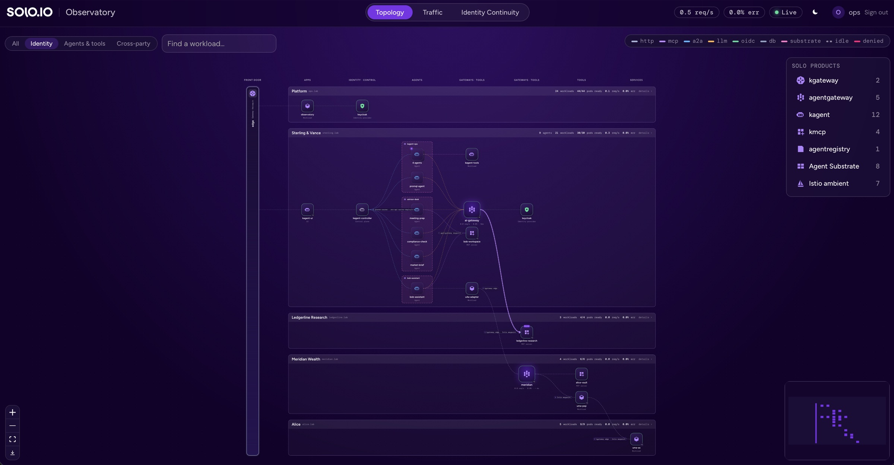
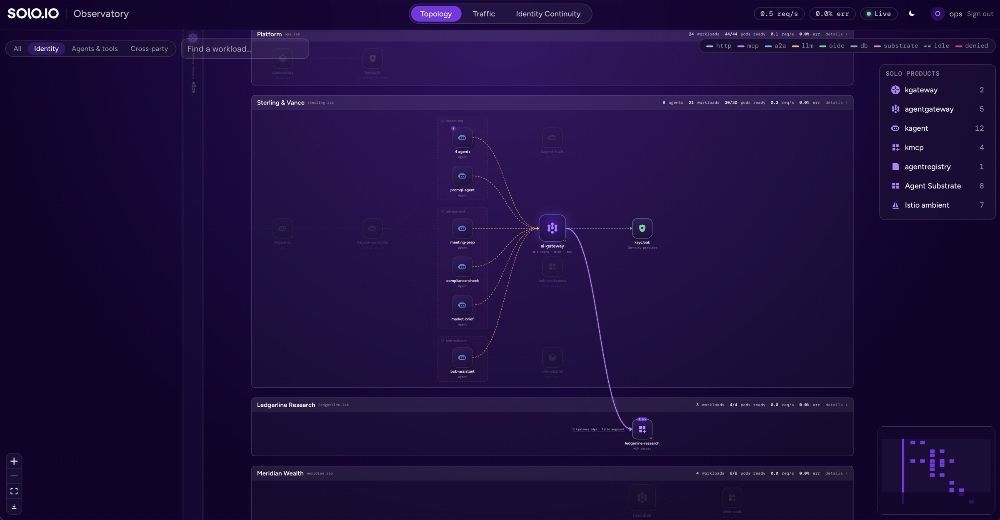
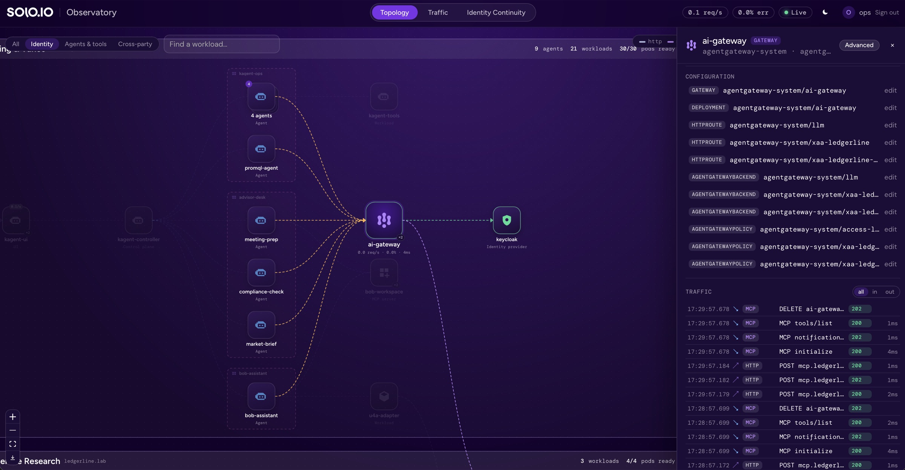
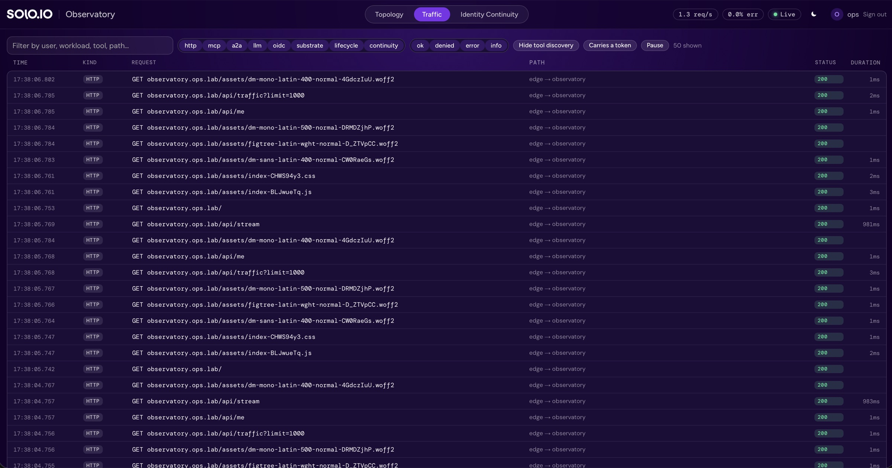
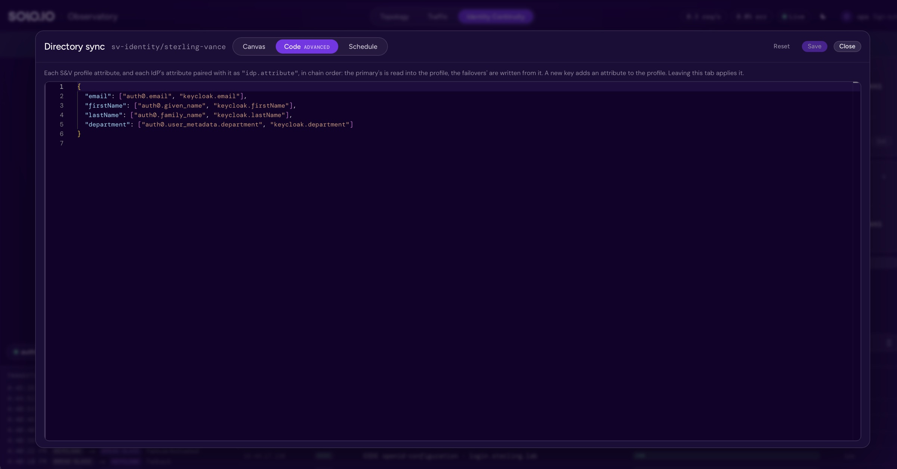
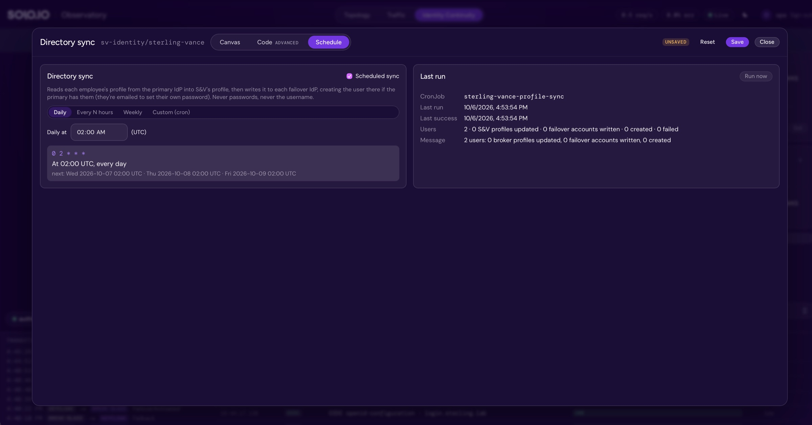

# Observatory

A live view of the whole lab for platform admins: what runs where, what calls
what, the traffic on each call, and the sign-in chain. It reads the cluster at
runtime and assumes nothing about this lab's names, so another cluster
renders the same way.

Source: `apps/observatory` (Go server in `server/`, React UI in `web/`).
Install: `platform/90-observatory` (`make layer-90`).

## Seeing it work

[](https://youtu.be/Y3P4a7HRvVs)

A three-minute walkthrough of all three tabs, [on YouTube](https://youtu.be/Y3P4a7HRvVs).

`make tour` drives every story end to end with real traffic, one scene at a
time, and prints where to look. The script for presenting it is the
[Observatory demo card](cards/observatory.html).

## Access

`https://observatory.ops.lab`, user `ops` / `ops-demo`.

Sign-in uses the Observatory's own Keycloak (namespace `ops-identity`, realm
`ops`), not the parties' IdPs. The edge runs the OAuth2 flow
(`GatewayExtension observatory-sso`) and forwards the access token; the server
verifies it again (issuer, audience `observatory`) and requires group
`observatory-admins`.

## Tabs

### Topology

Every workload, drawn as a layered diagram read left to right.



| Element | Meaning |
| --- | --- |
| Lane | a zone (party): namespaces with the same party label; the bar across its top is its live status |
| Column | a call stage: callers sit left of what they call; headings name what each stage mostly holds |
| Front door (left pillar) | the internet-facing kgateway; each zone's way in is a line out of it |
| Outside the lab (right column) | model providers and external services |
| Tray | an Agent Substrate worker pool around the agents it runs; lit bays are busy workers |
| Wire | a call. Colour is the protocol, thickness is traffic, moving dots mean traffic in the last window; dashed grey is configured but idle |
| Badge on a wire | a hop the call passes through: a waypoint, the edge, the Substrate router |
| Stack ("4 agents") | look-alike nodes with the same neighbours; open it to list or unfold them |

Interactions:

- Hover a node: it, its neighbours and its pool stay lit.

  

- Click a node: details (summary, tools, pods, mesh identity, connections,
  configuration, and only that node's traffic). **Advanced** opens the object's
  live YAML in an editor; Apply does a server-side dry run, shows the diff,
  then applies it as you. If the object changed since you loaded it, or a
  field you changed is owned by another manager (a controller, Helm), Apply
  says so instead of overwriting; **Apply anyway** takes the fields over.
  Policy, routing and identity continuity are editable; workloads, agents,
  gateway parameters, ConfigMaps, RBAC and Secrets open read-only.

  

- Click a zone's status bar: every workload in the zone by kind, including
  the idle ones the map folds away.
- Hover a wire: what it stands for, its rates and its recent calls.
- Views (top left): **All**; **Identity** (IdPs, SSO, token exchange,
  gateways that check tokens, and where each agent's token goes);
  **Agents & tools** (agents, gateways, MCP servers, models);
  **Cross-party** (only calls that cross a zone). Each view re-lays out.
- Product rail (right): hover or pin a Solo product to light every instance:
  tiles, badges on wires, Substrate trays, and a count on the status bar of a
  zone whose instances are folded away. Each product links to its docs on
  [docs.solo.io](https://docs.solo.io).
- Export (map controls, bottom left): saves the whole map, in its current
  view, as a PNG, such as [the All view](images/observatory-export-topology-all.jpg) or
  [the Identity view](images/observatory-export-topology-identity.jpg).

### Traffic

Every request any gateway saw, plus runtime events, newest first.



| Kind | Source |
| --- | --- |
| `http` `mcp` `a2a` `llm` `oidc` | gateway access logs (agentgateway, kgateway), over OTLP |
| `lifecycle` | pods created, ready, not ready, restarted |
| `substrate` | Substrate actors starting, suspending, resuming |
| `continuity` | sign-in failovers, and outages cut or restored from the Observatory |
| `model` | model provider outages cut or restored from the Observatory |

Filters: kind, outcome, free text (user, workload, tool, path), **Hide tool
discovery** (MCP `initialize` and `tools/list`), **Carries a token**, and Pause.
Expand a row for the parsed record or its raw JSON.

A request that carried a token shows a key badge. Expanded, each token is
listed with its type (access token, ID token, ID-JAG), whether the gateway
verified it, and its claims: subject, user, issuer, audience, `azp`, scope,
groups, `act`, issued and expiry times, and the full claim set on demand.

Raw tokens never reach the Observatory's store or the browser. Gateways log
only the verified claims (`jwt`; agentgateway redacts the raw token), and
any JWT found in another log field is decoded and replaced with a SHA-256
fingerprint before the record is kept.

### Identity Continuity

The sign-in chain for each `IdentityContinuity`, the outage button, the rule
builder, and the directory sync window. See
[IDENTITY-CONTINUITY.md](IDENTITY-CONTINUITY.md#in-the-observatory).


- **Directory sync, Canvas:** the IdPs in chain order on the left (the
  primary is read, the failovers are written), S&V's profile on the right.
  Each IdP lists the attributes its directory has; wires pair them with S&V's.
  Each IdP's **Directory · Edit** sets its type (`scim`, `auth0`,
  `keycloak`), URL, scopes, audience (Auth0) and credentials (write-only,
  written to Secret `directory-<idp>`); **Remove** stops syncing it.

  

- **Code:** the same mapping as JSON: each S&V attribute, then each IdP's
  attribute paired with it, in chain order. Leaving the tab applies it to
  the canvas.

  

- **Schedule:** when the sync runs (UTC cron, with presets), the last run's
  outcome, and **Run now**.

  

- **Assurance rules** (a button in the rule builder): what a sign-in must
  prove to reach what relies on the broker, whichever IdP it came through
  ([IDENTITY-CONTINUITY.md](IDENTITY-CONTINUITY.md#assurance-rules)). Every
  name comes from the chain and the cluster; every choice (levels,
  criticality, modes, sessions) from the installed CRDs; every outcome and
  reason from the assurance gate's evaluate API, for the rules as edited.
  - **Rules:** the rules, most critical first, each with its phase, mode and
    whether a gateway policy enforces it; what relies on the broker with no
    rule (apps that sign in through it, gateway policies that take its tokens
    without asking the gate), each with **Add a rule for it**; **+ Add rule**;
    and the **default rule** last. Each opens in the same form: about
    (description, criticality, owner, obligations), applies to (workloads
    from the mesh's identities, broker clients), requirements (each field of
    a rule shows the default rule's value until you override it),
    **Enforced at** (every gateway policy that takes the broker's tokens,
    with the rule it asks for: checking one makes that policy ask the gate
    for this rule, failing closed), and the outcome for each IdP.
  - **IdPs:** the chain in failover order; for each, what its acr and amr
    values are worth, its trust checks with **Check now**, and its outcome
    under every rule.
  - **What if:** one sign-in (IdP, acr, amr, how long ago) against every
    rule: the decision, the status a gateway would return, the reason, and
    the `acr_values` the user would be asked for.
  - **Code:** the same as HCL, one `default` block, an `idp` block per IdP
    and a `rule` block per rule; errors are marked at their line. Leaving
    the tab applies it.

    ```hcl
    default {
      minimum     = "AAL1"
      idps        = []          # every IdP in the chain
      break_glass = false
      enforced_at = []
    }

    idp "keycloak" {
      otherwise = "AAL1"
      acr       = { aal2 = "AAL2" }
    }

    rule "advisor-workspace" {
      criticality = "Critical"
      mode        = "Enforce"
      workloads   = ["sv-mcp/bob-workspace"]
      minimum     = "AAL2"     # what a rule leaves out is the default's
      enforced_at = ["sv-mcp/bob-workspace-caller"]
    }
    ```
  - Save writes, as you: the IdentityContinuity (default rule, IdPs), each
    rule's WorkloadProfile, and each gateway policy whose enforcement
    changed. Turning enforcement on at a policy also lets its namespace name
    the gate and its gateway call it, where nothing does yet (a
    ReferenceGrant and an AuthorizationPolicy beside the gate, labelled
    `continuity.lab.solo.io/assurance-gate-caller`). The gate applies it all
    to the next request.
- Each IdP's card shows its **trust** checks as a badge (every check on
  hover), and the banner names the enforced rules failing closed while the active
  IdP can't meet them.

### Model Continuity

The AI gateway's model chain: HTTPRoute `llm` (agentgateway-system), the
`AgentgatewayBackend` behind it, and the failover rules on policies
`llm-backend` and `llm-callers` (`AgentgatewayPolicy` on OSS,
`EnterpriseAgentgatewayPolicy` on enterprise). `make llm` rewrites the
chain from `.env`.

- **Map:** the callers `llm-callers` allows (agent pools, by mesh identity),
  the API-key callers of route `llm-external` when it exists, ai-gateway, and
  the providers in priority order. The provider that answered the latest call
  is lit; each has a health pill from the last five minutes of calls:
  Healthy, Errors, Outage (simulated) or Idle. Calls are matched to providers
  by the model that served them (`gen_ai.response.model`, else the request's).
- **Simulate model outage / Restore model provider:** points the chosen
  provider at a closed port (its own host on port 1, or `127.0.0.1:1` for a
  cloud provider) and keeps its host and port in backend annotation
  `lab.solo.io/outage-<provider>`; Restore puts them back. Calls to it fail as
  in a real outage and the gateway fails over. Both show in Traffic (`model`)
  with who did it, and the banner names the provider serving meanwhile.
- **Failover rules:** the providers in priority order (reorder, remove, edit
  the model) and **+ Add model connection**: Ollama / OpenAI-compatible
  (host, port, model; written as a `custom` provider speaking both the OpenAI
  and Anthropic APIs), OpenAI or Anthropic (model and API key). Save writes
  the backend (one provider as `spec.ai.provider`, two to four as one
  `spec.ai.groups` entry each), then only `backend.health` on `llm-backend`
  (**take a failed provider out for**, **after N failures**; a provider
  fails when it answers 5xx or doesn't answer) and only `traffic.retry` on `llm-callers` (**Retry
  the call**). A provider cut at the time stays cut. A chain changed since it
  was loaded is refused: Reload and edit again.
- **API keys** are write-only: key `Authorization` of the Secret the provider
  names (default `model-<name>`), labelled `lab.solo.io/model-credentials`.
  A new connection's key is written once Save has stored it.
- **Model traffic:** each recent call's caller, served model, status, tokens
  and cost (when the gateway prices it, `agw.ai.usage.cost.total`).
- **Enterprise controls** (enterprise only): the
  `EnterpriseAgentgatewayBudget` and `RateLimitConfig` objects, by name.

## Where the data comes from

| Data | Source |
| --- | --- |
| Nodes and declared edges | dynamic informers over workloads, Services, Gateway API routes, agentgateway backends and policies (either edition), kagent Agents, SandboxAgents, MCP servers, ModelConfigs, Substrate WorkerPools, Istio policies, CNPG clusters, IdentityContinuity, WorkloadProfile; rediscovered periodically |
| Assurance rules | the IdentityContinuity, its WorkloadProfiles, the agentgateway policies that take the broker's tokens or ask the assurance gate, the edge's SSO and the continuity CRDs (`/api/assurance/{ns}/{name}`); outcomes from the assurance gate's evaluate API (`/api/assurance/{ns}/{name}/evaluate`) |
| Observed edges, L4 rates | Prometheus: `istio_tcp_connections_opened_total{reporter="destination"}` from ztunnel |
| Requests, token claims | OTLP/HTTP logs on port 4318, from the platform collector |
| Substrate workers and actors | kagent's `/api/substrate/status` (actor state changes also go to Traffic) |

How the graph is built:

- A workload's Deployment merges into the resource that owns it (Gateway,
  Agent, SandboxAgent, MCPServer, WorkerPool).
- Edges come from HTTPRoutes and backends, RemoteMCPServer and ModelConfig
  URLs, policy and SSO references, URLs in env vars, and observed mesh
  connections.
- A call to a Service enrolled in a waypoint is drawn through that waypoint.
- A call to one of the edge's own hostnames is drawn to the service behind
  that hostname, with the edge as a badge.
- Solo products are recognised from images and gateway classes.

The browser gets everything over one Server-Sent Events stream (`/api/stream`:
`graph`, `stats`, `traffic`, `continuity`, `substrate`), except the model
chain, which the Model Continuity tab reads from `/api/models` as the
signed-in admin, and the assurance rules, which their window reads from
`/api/assurance/{ns}/{name}`.

## Access model

- The edge signs the admin in (realm `ops`) and forwards the access token.
  The server verifies it again: signature, issuer, audience `observatory`,
  issued to the edge's client (`azp`), an access token (`typ: Bearer`, not an
  ID token), and group `observatory-admins`. The live stream closes when that
  token expires; the browser reconnects through the edge, which refreshes
  the session or asks the admin to sign in again.
- Writes must come from the Observatory's own page: a request another site
  sends with the admin's session cookie is refused (`Sec-Fetch-Site` and
  `Origin`), and a write needs a JSON or YAML body, which a plain HTML form
  can't send. Every response carries a Content-Security-Policy that loads
  only the Observatory's own code and forbids framing.
- The server runs as ServiceAccount `observatory` with ClusterRole
  `observatory-read`: read the lab's resources (no Secrets), and impersonate
  exactly one identity.
- Every write (Apply, rule edits, secrets, outages, directory sync runs and
  directory tests) and the model chain's reads are made by impersonating
  user `observatory:admin` in group `observatory:observatory-admins`, with the
  signed-in person's name as the extra `observatory-user`. RBAC names all
  three (`platform/90-observatory/rbac.yaml`), so no request can make the
  Observatory any other user or group. The group is bound to ClusterRole
  `observatory-admin`: read what the Observatory shows (no Secrets) and
  change Gateway API, kgateway and agentgateway policies and backends, Istio
  security and networking, IdentityContinuity specs, and WorkloadProfiles
  (created, changed and removed; not their status, which is the controller's). Not workloads, agents,
  gateway parameters, ConfigMaps, RBAC, admission or `exec`. Admission keeps
  every policy that asks the assurance gate failing closed, theirs included.
- In `sv-identity` the group may also write Secrets and create Jobs, and
  admission (`platform/90-observatory/admission.yaml`) narrows both: Opaque
  Secrets labelled `continuity.lab.solo.io/credentials` only (the IdPs' and
  directories' credentials, never another Secret), and Jobs only from the
  profile sync's template. In `agentgateway-system` it may write Secrets, and
  admission allows only Opaque ones labelled `lab.solo.io/model-credentials`
  (model provider keys) that it created: never the gateway's license or any
  Secret it doesn't own. Granting a directory's Secret to the sync's Role
  is done as the Observatory's own account, which may update that one Role.
- With API server audit logging on, each write records the person in
  `impersonatedUser.extra`. `make observatory-verify` checks the scope.
- Client secrets and API keys entered in the rule builders are write-only.
- The namespace is STRICT mTLS; only the edge (8080) and the collector
  (4318) may call in.
- For Agent Substrate's runtime it calls kagent's `/api/substrate/status` with
  a token of its own S&V service account (client `observatory`); kagent wants
  a caller token even for status.

## Telemetry wiring

- `platform/90-observatory/telemetry.yaml`: access-log policies on ai-gateway,
  the S&V MCP waypoint and Meridian's gateway (agentgateway), and on the edge
  (kgateway ListenerPolicy), all to the OTel collector. S&V's two gateways
  also log the assurance gate's decision (`continuity.decision`). agentgateway sends to
  the collector's Service as a backend, so the export carries the gateway's
  mesh identity, which the collector's policy requires.
- `platform/20-observability/otel-collector.yaml`: access logs arrive on
  their own ports (14317 gRPC, 14318 HTTP), which the mesh policy opens only
  to the four gateways, and only that pipeline exports to
  `observatory.observatory.svc:4318`. So a claim shown as verified by a
  gateway came from one. Other components' OTLP (4317/4318) goes to Tempo and
  Prometheus; their logs are dropped.

## Server configuration

| Variable | Default | Meaning |
| --- | --- | --- |
| `OIDC_ISSUER` | | issuer of admin tokens |
| `OIDC_JWKS_URL` | | JWKS the server verifies against (the Keycloak Service, in-cluster) |
| `OIDC_AUDIENCE` | `observatory` | required audience |
| `OIDC_CLIENT_ID` | `observatory` | required `azp`: the client the edge signs in with |
| `ADMIN_GROUP` | `observatory-admins` | required group |
| `PROMETHEUS_URL` | | Prometheus for mesh edges and L4 rates (optional) |
| `KAGENT_URL` | | kagent controller for Substrate status (optional) |
| `KAGENT_TOKEN_URL`, `KAGENT_CLIENT_ID`, `KAGENT_CLIENT_SECRET` | | client-credentials token for kagent (needed when kagent requires a caller token) |
| `TRUST_DOMAIN` | `cluster.local` | the mesh's SPIFFE trust domain, for matching identities to workloads |
| `TELEMETRY_NAMESPACE` | `observability` | where the telemetry backends run: calls into it are drawn as plumbing |
| `PARTY_LABEL` | `lab.solo.io/party` | namespace label that defines zones |
| `LISTEN`, `OTLP_LISTEN` | `:8080`, `:4318` | UI/API and OTLP listeners |
| `OBSERVATORY_DEV_USER` | | local development only: skip sign-in as this user (ignored in a cluster) |
| `ASSURANCE_GATE_URL` | | local development only: the assurance gate's evaluate port, through a port-forward (ignored in a cluster) |

## Using it on another cluster

Zones come from a namespace label. A workload's role (the tile's shape) is
guessed from its images and name; label it `observatory.solo.io/kind` (`idp`,
`db`, `ui`, `controller`, `tool`, `workload`) to say it outright. Set
`TRUST_DOMAIN` and `TELEMETRY_NAMESPACE` if yours differ.

```yaml
metadata:
  labels:
    lab.solo.io/party: acme            # the zone id (PARTY_LABEL)
  annotations:
    observatory.solo.io/party-name: "Acme Corp"
    observatory.solo.io/party-order: "10"   # optional
```

Unlabelled namespaces are grouped as `cluster` and left off the map. Without
Prometheus the map shows declared edges only; without OTLP logs the Traffic
tab shows runtime events only.

## Local development

Runs against your current kubeconfig context, as you.

```bash
cd apps/observatory/web && npm ci && npm run build        # writes ../server/web
cd ../server && go build -o /tmp/obs .                    # Go 1.27
kubectl --context kind-solo-lab -n observability port-forward svc/kps-prometheus 19090:9090 &
kubectl --context kind-solo-lab -n sv-identity port-forward svc/assurance-gate 19002:evaluate &
OBSERVATORY_DEV_USER=$USER PROMETHEUS_URL=http://127.0.0.1:19090 ASSURANCE_GATE_URL=http://127.0.0.1:19002 \
  LISTEN=127.0.0.1:8080 OTLP_LISTEN=127.0.0.1:14318 /tmp/obs
```

Open http://127.0.0.1:8080. `npm run dev` in `web/` serves the UI with hot
reload and proxies `/api` to that server. `/tmp/obs graph` prints the derived
graph as JSON and exits.

Gateway access logs go to the in-cluster Observatory, not a local one, so
the local Traffic tab has runtime events only. To test log parsing, POST an
OTLP/JSON logs body to `http://127.0.0.1:14318/v1/logs`.

Without a local Go toolchain, build in a container:

```bash
docker run --rm -u "$(id -u):$(id -g)" -e GOCACHE=/tmp/gocache -e GOPATH=/tmp/go -v "$PWD":/src -w /src \
  -e GOOS="$(uname -s | tr A-Z a-z)" -e GOARCH="$(uname -m | sed 's/x86_64/amd64/;s/aarch64/arm64/')" \
  golang:1.27-alpine go build -o obs .
```

Tests: `go test ./...` in `server/`, `npm run build` (type-check) in `web/`.

Deploy a change with `make layer-90`. The image tag is a hash of the source,
so any change rolls out.
